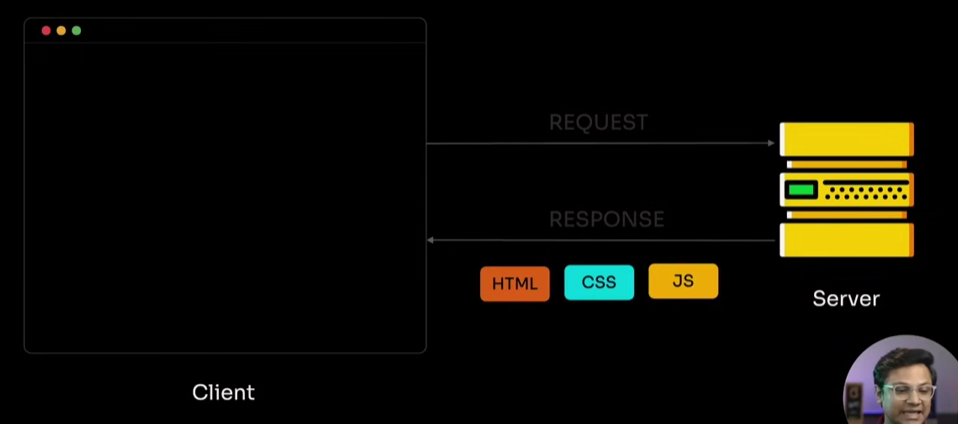
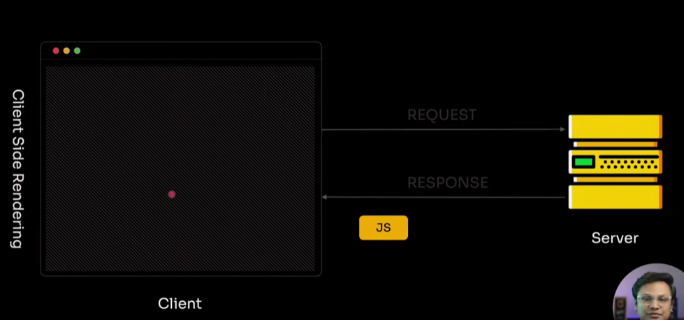
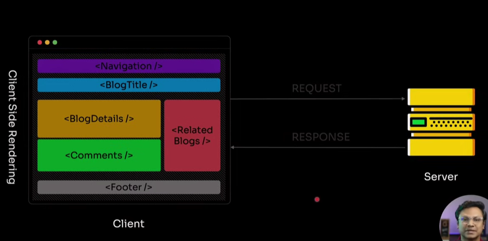
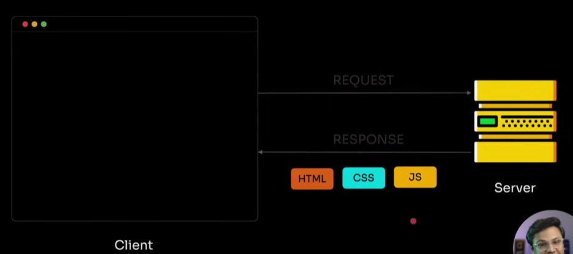
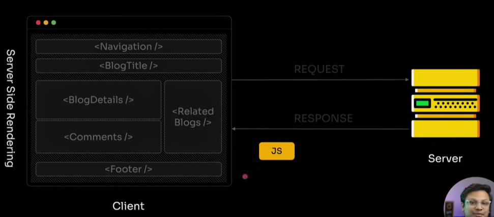
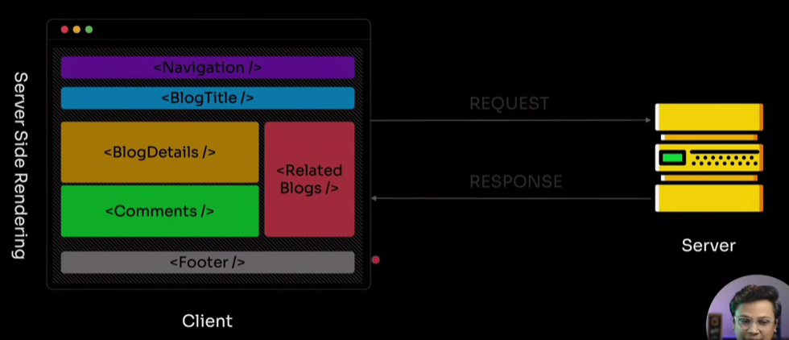

<h1 align="center">Next.js Notes</h1>

- [Setup:](#setup)
- [Introduction:](#introduction)
    - [What is Next.js:](#what-is-nextjs)
    - [Key Features of Next.js:](#key-features-of-nextjs)
    - [Components in Next.js:](#components-in-nextjs)
    - [Difference Between Server Component and Client Component:](#difference-between-server-component-and-client-component)
    - [Next.js Renderings:](#nextjs-renderings)
      - [1. Client Side Rendering(CSR):](#1-client-side-renderingcsr)
        - [LifeCycle of CSR:](#lifecycle-of-csr)
        - [Problems with CSR:](#problems-with-csr)
        - [When to use CSR:](#when-to-use-csr)
      - [2. Server Side Rendering(SSR):](#2-server-side-renderingssr)
        - [LifeCycle of SSR:](#lifecycle-of-ssr)
        - [Problems with SSR:](#problems-with-ssr)
        - [When to use SSR:](#when-to-use-ssr)
      - [3. Static Site Generation(SSG):](#3-static-site-generationssg)
        - [LifeCycle of SSG:](#lifecycle-of-ssg)
        - [Problems with SSG:](#problems-with-ssg)
        - [When to use SSG:](#when-to-use-ssg)
      - [4. Incremental Static Regeneration(ISR):](#4-incremental-static-regenerationisr)
      - [When to use ISR:](#when-to-use-isr)
    - [Difference Between CSR, SSR, SSG, ISR:](#difference-between-csr-ssr-ssg-isr)
    - [Difference Between Library and Framework:](#difference-between-library-and-framework)

# Setup: 

# Introduction: 

### What is Next.js: 
Next.js is a React framework for building high-performance, SEO-optimized web applications. It extends React by providing structured routing, data fetching model, built-in backend capabilities, different types of optimization, and multiple rendering strategies within a single unified framework.

### Key Features of Next.js: 
- Multiple rendering (CSR, SSR, SSG, ISR)
- File-based routing system
- Built-in API routes 
- Built-in Data Fetching: `getStaticProps`, `getServerSideProps`, `getStaticPaths`, `fetch` (for client components)
- Built-in SEO Optimization
- Built-in Image and font Optimization
- Built-in TS and Tailwind css support
- Automatic Code Splitting: Only loads the JavaScript needed for each page, improving performance.

### Components in Next.js: 
In Next.js, there are two types of components: 

- Server Component: A React component that runs on the server and sends pre-rendered HTML.

- Client Component: A React component that runs in the browser and the browser downloads and executes the JavaScript to render the HTML adn add ui interactivity to the page.

Note: In Next.js, components are server components by default. To make a component a client component, you need to add the "use client" directive at the top of the component file.

### Difference Between Server Component and Client Component:  

| Feature                                             | Server Component          | Client Component                  |
| --------------------------------------------------- | ------------------------- | --------------------------------- |
| **Runs on**                                         | Server only               | Browser only                      |
| **Can use `useState`/`useEffect`**                  | No                        | Yes                               |
| **Can use browser APIs (`window`, `localStorage`)** | No                        | Yes                               |
| **Can fetch data directly from database or API**    | Yes                       | Only via API route                |
| **Default in Next.js 13+**                          | Yes                       | Must add `"use client"`           |
| **Use case**                                        | server related works only | UI interaction related works only |

### Next.js Renderings:

Rendering in Next.js is the process of converting your React components and data into HTML, CSS, and JavaScript that the browser can display. Depending on how the component is configured, Rendering can happen in different ways in Next.js:, like: 
- Client Side Rendering (CSR): done in the browser.
- Server Side Rendering (SSR): done on the server for every request.
- Static Site Generation (SSG): done once at build time.
- Incremental Static Regeneration (ISR): done at build time and updated later automatically within a revalidation period.

#### 1. Client Side Rendering(CSR): 
CSR is the default rendering method for React. Since Next.js components are server by default, we need the 'use client' directive to make a component run on the client.

##### LifeCycle of CSR: 
- Browser sends a request to the server
- Server sends a minimal HTML file (usually containing 

), along with CSS and JavaScript bundles
- The HTML displays a blank root div while the JavaScript is being downloaded and executed
- Once the JavaScript bundle is executed, React mounts the application inside the root div
- After that, data fetching happens (via useEffect or other client-side hooks), and the UI updates whenever the data is received

**Note:** In React mounting is the process where a React component is created and inserted into the DOM (the HTML structure of the page) for the first time.

##### Problems with CSR: 
- SEO limitations: Search engines may see just a black div with id root, which can lead to poor search engine rankings.
- Performance issues: Users see a black page for a few seconds until the JavaScript is fully downloaded and executed, This can negatively impact:
  - First Contentful Paint (FCP)
  - Time To Interactive (TTI)

##### When to use CSR: 
- When SEO is not a concern
- When you have a highly interactive application that relies heavily on user interactions.

#### 2. Server Side Rendering(SSR): 
Server-Side Rendering means that React components are rendered on the server for each request, and the browser receives fully rendered HTML instead of a blank page.Next.js optimizes SSR by caching rendered pages, so for subsequent requests, it can serve cached HTML without re-rendering on the server.

##### LifeCycle of SSR:
- browser sends a requests to the server
- Server executes React components and fetches required data.
- Server sends pre-rendered HTML (with content already inside the root container), along with CSS and JavaScript bundles.
- The browser displays the rendered HTML immediately
- Once the JavaScript is downloaded and executed, React hydrates the page.

**Note**: Hydration means React takes the HTML that was rendered on the server (or pre-built) and “activates” it in the browser by attaching event listeners, connecting it to React’s virtual DOM, and making it fully interactive.

##### Problems with SSR:
- Increased server load: The server must render pages per request (next.js handles it by caching)..
- Still requires JavaScript to be fully interactive, so even the first contentful paint (FCP) is faster, the time to interactive (TTI) still be delayed until the JavaScript is fully executed (next.js handles it by RSC)

##### When to use SSR: 
- When SEO is a concern
- When you want to ensure faster first contentful paint (FCP).

#### 3. Static Site Generation(SSG): 
Static Site Generation (SSG) means that React components are rendered to HTML at build time, instead of on each request. The server generates the HTML once during the build, and the same pre-rendered HTML is served to all requests.

In Next.js, we need to use getStaticProps() to fetch data at build time and can getStaticPaths() for dynamic routes that need pre-rendering.

##### LifeCycle of SSG: 

At Build Time: 
- Next.js executes React components and fetches data (if any).
- Static HTML files are generated for each page along with CSS and JS bundles.

At Request Time: 
- Browser sends a request to the server.
- Server serves the pre-rendered HTML immediately along with CSS and JS bundles.
- If the page contains client-side components, React hydrates them after the JavaScript is downloaded and executed.

##### Problems with SSG: 
- Content can become outdated.
- Requires rebuilding the app to update content (unless using ISR).
- Not ideal for highly dynamic data.

##### When to use SSG: 
- Blog posts
- Marketing pages
- Documentation sites

#### 4. Incremental Static Regeneration(ISR): 
ISR allows you to update SSG pages after deployment without rebuilding the entire application. ISR is same as SSG but here you can specify a revalidation time for each page, and Next.js will automatically regenerate the page in the background when a request comes in after the revalidation time has passed.

Incremental Static Regeneration (ISR) is a feature in Next.js that combines the speed of SSG with the flexibility of SSR. With ISR, we can specify a revalidation time for each page, and Next.js will automatically regenerate the page in the background when a request comes in after the revalidation time has passed.

#### When to use ISR: 
- E-commerce product pages
- News articles
- Blog posts with occasional updates
- Any content that changes but not every second

### Difference Between CSR, SSR, SSG, ISR: 

| Feature            | **CSR**                 | **SSR**                       | **SSG**                       | **ISR**                                                   |
| ------------------ | ----------------------- | ----------------------------- | ----------------------------- | --------------------------------------------------------- |
| **Where rendered** | Browser                 | Server per request            | Server at build               | Server at build + periodic updates                        |
| **HTML sent**      | Mostly empty            | Fully rendered                | Fully rendered                | Fully rendered                                            |
| **Data fetching**  | Client (`useEffect`)    | Server (`getServerSideProps`) | Build time (`getStaticProps`) | Build time + background (`getStaticProps` + `revalidate`) |
| **Interactivity**  | Hydrates after JS loads | Hydrates after HTML           | Hydrates after HTML           | Hydrates after HTML                                       |
| **Speed / FCP**    | Slower first paint      | Fast                          | Very fast                     | Very fast, updated in background                          |
| **SEO**            | Poor                    | Good                          | Excellent                     | Excellent                                                 |
| **Best use case**  | Interactive apps        | Dynamic pages                 | Static pages                  | Mostly static pages with occasional updates               |
| **Server load**    | Low                     | Higher                        | Very low                      | Low                                                       |
| **Examples**       | Dashboards, chats       | User profiles                 | Blogs, docs                   | Products, news                                            |

Summary: 
- CSR: Rendering happens in the browser. Good for highly interactive apps.
- SSR: Rendering happens on the server for every request. Good for dynamic pages that need fresh data.
- SSG: Rendering happens once at build time. Good for static content that rarely changes.
- ISR: Like SSG, but pages regenerate in the background after a revalidation time. Best for mostly static pages that occasionally update.

### Difference Between Library and Framework: 

| library                                                                                                                                                  | framework                                                                                                                             |
| -------------------------------------------------------------------------------------------------------------------------------------------------------- | ------------------------------------------------------------------------------------------------------------------------------------- |
| A library is a collection of pre-written code that you can pick and use whenever you need. You decide when to call it and how to use it in your program. | A framework is a pre-defined structure that you must follow to build your application. It decides when your code runs and how to use. |
| you cal the library, means you decide when and how to use it.                                                                                            | the framework cal you, means it decide when and how to use it.                                                                        |
| more flexible, you can combine with others tolls                                                                                                         | less flexible, you must follow its rules and conventions                                                                              |
| focus on specific task                                                                                                                                   | provides a full solution for building entire apps                                                                                     |

