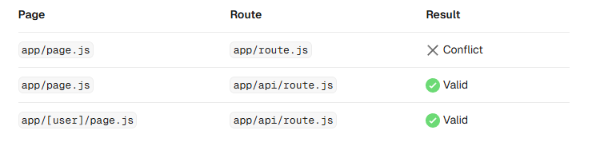

<h1 align="center">Next.js Notes</h1>

- [Setup:](#setup)
- [Introduction:](#introduction)
    - [What is Next.js:](#what-is-nextjs)
    - [Key Features of Next.js:](#key-features-of-nextjs)
    - [Difference Between Library and Framework:](#difference-between-library-and-framework)
    - [Difference Between React and Next.js:](#difference-between-react-and-nextjs)
- [Components in Next.js:](#components-in-nextjs)
  - [When to use Server and Client Components:](#when-to-use-server-and-client-components)
  - [Examples:](#examples)
    - [Using Client Components:](#using-client-components)
    - [Reducing JS bundle size:](#reducing-js-bundle-size)
    - [Passing data from Server to Client Components:](#passing-data-from-server-to-client-components)
    - [Interleaving Server and Client Components:](#interleaving-server-and-client-components)
    - [Context providers:](#context-providers)
    - [Sharing data with context and React.cache:](#sharing-data-with-context-and-reactcache)
    - [Third-party components:](#third-party-components)
    - [Preventing environment poisoning:](#preventing-environment-poisoning)
- [Next.js Renderings:](#nextjs-renderings)
  - [1. Client Side Rendering(CSR):](#1-client-side-renderingcsr)
    - [LifeCycle of CSR:](#lifecycle-of-csr)
    - [Problems with CSR:](#problems-with-csr)
    - [When to use CSR:](#when-to-use-csr)
  - [2. Server Side Rendering(SSR):](#2-server-side-renderingssr)
    - [LifeCycle of SSR:](#lifecycle-of-ssr)
    - [Problems with SSR:](#problems-with-ssr)
    - [When to use SSR:](#when-to-use-ssr)
  - [3. Static Site Generation(SSG):](#3-static-site-generationssg)
    - [LifeCycle of SSG:](#lifecycle-of-ssg)
    - [Problems with SSG:](#problems-with-ssg)
    - [When to use SSG:](#when-to-use-ssg)
  - [4. Incremental Static Regeneration(ISR):](#4-incremental-static-regenerationisr)
  - [Difference Between CSR, SSR, SSG, ISR:](#difference-between-csr-ssr-ssg-isr)
- [Folder and File Conventions:](#folder-and-file-conventions)
  - [Top-level Folders:](#top-level-folders)
  - [Top-level Files:](#top-level-files)
  - [Routing Files:](#routing-files)
  - [Nested Routes:](#nested-routes)
  - [Dynamic Routes:](#dynamic-routes)
  - [Parallel Routes:](#parallel-routes)
  - [Intercepted Routes:](#intercepted-routes)
    - [1. Intercept Sibling (.)folder:](#1-intercept-sibling-folder)
    - [2. Intercept Parent (..)folder:](#2-intercept-parent-folder)
    - [3. Intercept Two Levels (..)(..)folder:](#3-intercept-two-levels-folder)
    - [4. Intercept From Root (...)folder](#4-intercept-from-root-folder)
  - [Route Groups and Private Folders:](#route-groups-and-private-folders)
    - [Route Groups:](#route-groups)
    - [Private Folders:](#private-folders)
  - [Organizing project:](#organizing-project)
    - [Colocation:](#colocation)
    - [Private Folders:](#private-folders-1)
    - [Route groups:](#route-groups-1)
    - [src folder](#src-folder)
    - [Store project files outside of app:](#store-project-files-outside-of-app)
    - [Store project files in top-level folders inside of app:](#store-project-files-in-top-level-folders-inside-of-app)
    - [Split project files by feature or route:](#split-project-files-by-feature-or-route)
    - [Organize routes without affecting the URL path:](#organize-routes-without-affecting-the-url-path)
    - [Opting specific segments into a layout:](#opting-specific-segments-into-a-layout)
    - [Opting for loading skeletons on a specific route:](#opting-for-loading-skeletons-on-a-specific-route)
    - [Creating multiple root layouts:](#creating-multiple-root-layouts)
- [Layouts and Pages:](#layouts-and-pages)
  - [Creating a page:](#creating-a-page)
  - [Creating a layout:](#creating-a-layout)
  - [Creating a nested route:](#creating-a-nested-route)
  - [Nesting layouts:](#nesting-layouts)
  - [Creating a dynamic segment:](#creating-a-dynamic-segment)
  - [Linking between pages:](#linking-between-pages)
- [Linking and Navigating:](#linking-and-navigating)
    - [1. Server Side Rendering:](#1-server-side-rendering)
    - [2. Prefetching:](#2-prefetching)
    - [3. Streaming:](#3-streaming)
    - [4. Client-side Transitions:](#4-client-side-transitions)
    - [What can make transitions slow:](#what-can-make-transitions-slow)
      - [1. Dynamic routes without loading.tsx:](#1-dynamic-routes-without-loadingtsx)
      - [2. Dynamic segments without generateStaticParams:](#2-dynamic-segments-without-generatestaticparams)
      - [3. Slow networks:](#3-slow-networks)
      - [4. Disabling prefetching:](#4-disabling-prefetching)
      - [5. Hydration not completed:](#5-hydration-not-completed)
- [Cache Components:](#cache-components)
  - [How rendering works with Cache Components:](#how-rendering-works-with-cache-components)
  - [Automatically pre-rendered content:](#automatically-pre-rendered-content)
  - [Defer rendering to request time:](#defer-rendering-to-request-time)
    - [Types of Dynamic Work](#types-of-dynamic-work)
      - [External / Async Content:](#external--async-content)
    - [Runtime Data (Request-Based Data):](#runtime-data-request-based-data)
    - [Non-Deterministic Operations:](#non-deterministic-operations)
  - [Using use cache:](#using-use-cache)
    - [Caching During pre-rendering:](#caching-during-pre-rendering)
    - [Caching With runtime data:](#caching-with-runtime-data)
    - [Casing With non-deterministic operations:](#casing-with-non-deterministic-operations)
    - [Tagging and revalidating:](#tagging-and-revalidating)
      - [updateTag:](#updatetag)
      - [revalidateTag:](#revalidatetag)
    - [When To Use Caching:](#when-to-use-caching)
    - [Example:](#example)
- [Fetching Data:](#fetching-data)
  - [1. Server Components:](#1-server-components)
    - [With the fetch API:](#with-the-fetch-api)
    - [With an ORM or database](#with-an-orm-or-database)
  - [2. Client Components:](#2-client-components)
    - [Streaming data with the use API:](#streaming-data-with-the-use-api)
    - [Community libraries:](#community-libraries)
      - [Tanstack Query:](#tanstack-query)
  - [Streaming:](#streaming)
    - [With loading.js:](#with-loadingjs)
    - [With `<Suspense>`:](#with-suspense)
  - [Examples:](#examples-1)
    - [Sequential data fetching:](#sequential-data-fetching)
    - [Parallel data fetching:](#parallel-data-fetching)
    - [Preloading data:](#preloading-data)
- [Updating Data:](#updating-data)
  - [What are Server Functions:](#what-are-server-functions)
  - [Creating Server Functions:](#creating-server-functions)
    - [Server Components:](#server-components)
    - [Client Components:](#client-components)
    - [Passing actions as props:](#passing-actions-as-props)
  - [Invoking Server Functions:](#invoking-server-functions)
    - [Forms:](#forms)
    - [Event Handlers:](#event-handlers)
  - [Examples:](#examples-2)
    - [Showing a pending state:](#showing-a-pending-state)
    - [Refreshing:](#refreshing)
    - [Revalidating:](#revalidating)
    - [Redirecting:](#redirecting)
    - [Cookies:](#cookies)
    - [useEffect:](#useeffect)
- [Caching and Revalidating:](#caching-and-revalidating)
  - [fetch:](#fetch)
  - [cacheTag:](#cachetag)
  - [revalidateTag:](#revalidatetag-1)
  - [updateTag:](#updatetag-1)
  - [revalidatePath:](#revalidatepath)
- [Error Handling:](#error-handling)
  - [Handling Expected Errors:](#handling-expected-errors)
    - [Server Functions:](#server-functions)
    - [Server Components:](#server-components-1)
    - [Not found:](#not-found)
  - [Handling uncaught exceptions:](#handling-uncaught-exceptions)
    - [Nested error boundaries:](#nested-error-boundaries)
    - [Global errors:](#global-errors)
- [Image Optimization:](#image-optimization)
  - [Local images:](#local-images)
  - [Remote images:](#remote-images)
- [Font Optimization:](#font-optimization)
  - [Google Fonts:](#google-fonts)
  - [Local fonts:](#local-fonts)
- [Metadata:](#metadata)
  - [Default fields:](#default-fields)
  - [Static metadata:](#static-metadata)
  - [Generated metadata:](#generated-metadata)
    - [Memoizing data requests:](#memoizing-data-requests)
- [Route Handlers:](#route-handlers)
  - [Convention:](#convention)
  - [Supported HTTP Methods:](#supported-http-methods)
  - [Caching:](#caching)
    - [With Cache Components:](#with-cache-components)
      - [Static example:](#static-example)
      - [Dynamic example:](#dynamic-example)
      - [Runtime data example:](#runtime-data-example)
    - [Cached example:](#cached-example)
  - [Route Resolution:](#route-resolution)
  - [Route Context Helper:](#route-context-helper)
- [Proxy:](#proxy)

# Setup: 

Step 1: Create a new Next.js project:

```bash
npx create-next-app@latest
```

Then answer the following question, since we need to write our code on `src` folder, so we chose the 3rd options:

```
What is your project named? my-app
```

```
? Would you like to use the recommended Next.js defaults? » - Use arrow-keys. Return to submit.
    Yes, use recommended defaults
    No, reuse previous settings
>   No, customize settings - Choose your own preferences
```

Then answer the following questions: 

```
√ Would you like to use TypeScript? ... No / Yes
√ Which linter would you like to use? » ESLint
√ Would you like to use React Compiler? ... No / Yes
√ Would you like to use Tailwind CSS? ... No / Yes
√ Would you like your code inside a `src/` directory? ... No / Yes
√ Would you like to use App Router? (recommended) ... No / Yes
√ Would you like to customize the import alias (`@/*` by default)? ... No / Yes
Creating a new Next.js app in C:\Users\conta\Desktop\test\my-test-app.
```

Step 2: If you want to install daisyUI: 

```bash
npm i daisyui@latest
npm pkg set browserslist="> 1%"
```

app/global.css:

```
@import "tailwindcss";
@plugin "daisyui";
```


# Introduction: 

### What is Next.js: 
Next.js is a React framework for building high-performance, SEO-optimized web applications. It extends React by providing structured routing, data fetching model, built-in backend capabilities, different types of optimization, and multiple rendering strategies within a single unified framework.

### Key Features of Next.js: 
- Multiple rendering (CSR, SSR, SSG, ISR)
- File-based routing system
- Built-in API routes 
- Built-in Data Fetching: `getStaticProps`, `getServerSideProps`, `getStaticPaths`, `fetch` (for client components)
- Built-in SEO Optimization
- Built-in Image and font Optimization
- Built-in TS and Tailwind css support
- Automatic Code Splitting: Only loads the JavaScript needed for each page, improving performance.


### Difference Between Library and Framework: 

| library                                                                                                                                                  | framework                                                                                                                             |
| -------------------------------------------------------------------------------------------------------------------------------------------------------- | ------------------------------------------------------------------------------------------------------------------------------------- |
| A library is a collection of pre-written code that you can pick and use whenever you need. You decide when to call it and how to use it in your program. | A framework is a pre-defined structure that you must follow to build your application. It decides when your code runs and how to use. |
| you cal the library, means you decide when and how to use it.                                                                                            | the framework cal you, means it decide when and how to use it.                                                                        |
| more flexible, you can combine with others tolls                                                                                                         | less flexible, you must follow its rules and conventions                                                                              |
| focus on specific task                                                                                                                                   | provides a full solution for building entire apps                                                                                     |

### Difference Between React and Next.js: 

| Feature                  | **React**                                 | **Next.js**                                   |
| ------------------------ | ----------------------------------------- | --------------------------------------------- |
| **Type**                 | JavaScript library for building UI        | React Framework for building full-stack apps  |
| **Rendering**            | Only client-side by default (CSR)         | Supports CSR, SSR, SSG, and ISR               |
| **Routing**              | Manual with libraries like `react-router` | File-based routing built-in                   |
| **Server-side features** | Needs additional setup                    | Built-in API routes and server-side rendering |
| **SEO**                  | Poor by default (CSR)                     | Built-in SEO Optimization                     |


# Components in Next.js: 
In Next.js, there are two types of components: 

- Server Component: A React component that runs on the server. It has different types of rendering methods like SSR, SSG, ISR. 

- Client Component: A React component that runs on the browser. It has only one type of rendering methods that is CSR.

Note: In Next.js, components are server components by default. To make a component a client component, you need to add the "use client" directive at the top of the component file.

## When to use Server and Client Components: 
The client and server environments have different capabilities. Server and Client components allow you to run logic in each environment depending on your use case.

Use Client Components when you need:
- State and event handlers. E.g. onClick, onChange.
- Lifecycle logic. E.g. useEffect.
- Browser-only APIs. E.g. localStorage, window, Navigator.geolocation, etc.
- Custom hooks.

Use Server Components when you need:
- Fetch data from databases or APIs close to the source.
- Use API keys, tokens, and other secrets without exposing them to the client.
- Reduce the amount of JavaScript sent to the browser.
- Improve the First Contentful Paint (FCP), and stream content progressively to the client.

For example, the `<Page>` component is a Server Component that fetches data about a post, and passes it as props to the `<LikeButton>` which handles client-side interactivity.

app/[id]/page.tsx:

```tsx
import LikeButton from '@/app/ui/like-button'
import { getPost } from '@/lib/data'
 
export default async function Page({
  params,
}: {
  params: Promise<{ id: string }>
}) {
  const { id } = await params
  const post = await getPost(id)
 
  return (
    <div>
      <main>
        <h1>{post.title}</h1>
        {/* ... */}
        <LikeButton likes={post.likes} />
      </main>
    </div>
  )
}
```
app/ui/like-button.tsx
```tsx
'use client'
 
import { useState } from 'react'
 
export default function LikeButton({ likes }: { likes: number }) {
  // ...
}
```

## Examples: 

### Using Client Components: 

we can create a Client Component by adding the "use client" directive at the top of the file, above your imports.

```tsx
'use client'
 
import { useState } from 'react'
 
export default function Counter() {
  const [count, setCount] = useState(0)
 
  return (
    <div>
      <p>{count} likes</p>
      <button onClick={() => setCount(count + 1)}>Click me</button>
    </div>
  )
}
```

"use client" is used to declare a boundary between the Server and Client module graphs (trees).

Once a file is marked with "use client", all its imports and child components are considered part of the client bundle. This means you don't need to add the directive to every component that is intended for the client.

### Reducing JS bundle size: 

To reduce the size of your client JavaScript bundles, add 'use client' to specific interactive components instead of marking large parts of your UI as Client Components.

For example, the `<Layout>` component contains mostly static elements like a logo and navigation links, but includes an interactive search bar. `<Search />` is interactive and needs to be a Client Component, however, the rest of the layout can remain a Server Component.

```tsx
// Client Component
import Search from './search'
// Server Component
import Logo from './logo'
 
// Layout is a Server Component by default
export default function Layout({ children }: { children: React.ReactNode }) {
  return (
    <>
      <nav>
        <Logo />
        <Search />
      </nav>
      <main>{children}</main>
    </>
  )
}
```

```tsx
'use client'
 
export default function Search() {
  // ...
}
```

### Passing data from Server to Client Components: 

You can pass data from Server Components to Client Components using props.

```tsx
import LikeButton from '@/app/ui/like-button'
import { getPost } from '@/lib/data'
 
export default async function Page({
  params,
}: {
  params: Promise<{ id: string }>
}) {
  const { id } = await params
  const post = await getPost(id)
 
  return <LikeButton likes={post.likes} />
}
```

```tsx
'use client'
 
export default function LikeButton({ likes }: { likes: number }) {
  // ...
}
```

Alternatively, you can stream data from a Server Component to a Client Component with the use API.

```tsx
import Posts from '@/app/ui/posts'
import { Suspense } from 'react'
 
export default function Page() {
  // Don't await the data fetching function
  const posts = getPosts()
 
  return (
    <Suspense fallback={<div>Loading...</div>}>
      <Posts posts={posts} />
    </Suspense>
  )
}
```

Then, in your Client Component, use the use API to read the promise:

```tsx
'use client'
import { use } from 'react'
 
export default function Posts({
  posts,
}: {
  posts: Promise<{ id: string; title: string }[]>
}) {
  const allPosts = use(posts)
 
  return (
    <ul>
      {allPosts.map((post) => (
        <li key={post.id}>{post.title}</li>
      ))}
    </ul>
  )
}
```

In the example above, the `<Posts>` component is wrapped in a `<Suspense>` boundary. This means the fallback will be shown while the promise is being resolved. 

### Interleaving Server and Client Components: 
You can pass Server Components as a prop to a Client Component. This allows you to visually nest server-rendered UI within Client components.

A common pattern is to use children to create a slot in a `<ClientComponent>`. For example, a `<Cart>` component that fetches data on the server, inside a `<Modal>` component that uses client state to toggle visibility.

```tsx
'use client'
 
export default function Modal({ children }: { children: React.ReactNode }) {
  return <div>{children}</div>
}
```
Then, in a parent Server Component (e.g.`<Page>`), you can pass a `<Cart>` as the child of the `<Modal>`:

```tsx
import Modal from './ui/modal'
import Cart from './ui/cart'
 
export default function Page() {
  return (
    <Modal>
      <Cart />
    </Modal>
  )
}
```

### Context providers: 
React context is commonly used to share global state like the current theme. However, React context is not supported in Server Components.

To use context, create a Client Component that accepts children:

```tsx
'use client'
 
import { createContext } from 'react'
 
export const ThemeContext = createContext({})
 
export default function ThemeProvider({
  children,
}: {
  children: React.ReactNode
}) {
  return <ThemeContext.Provider value="dark">{children}</ThemeContext.Provider>
}
```

Then, import it into a Server Component (e.g. layout):

```tsx
import ThemeProvider from './theme-provider'
 
export default function RootLayout({
  children,
}: {
  children: React.ReactNode
}) {
  return (
    <html>
      <body>
        <ThemeProvider>{children}</ThemeProvider>
      </body>
    </html>
  )
}
```
our Server Component will now be able to directly render your provider, and all other Client Components throughout your app will be able to consume this context.

### Sharing data with context and React.cache: 

You can share fetched data across both Server and Client Components by combining React.cache with context providers.

Create a cached function that fetches data:

```tsx
// app/lib/user.ts
import { cache } from 'react'
 
export const getUser = cache(async () => {
  const res = await fetch('https://api.example.com/user')
  return res.json()
})
```

Create a context provider that stores the promise:

```tsx
// app/user-provider.tsx
'use client'
 
import { createContext } from 'react'
 
type User = {
  id: string
  name: string
}
 
export const UserContext = createContext<Promise<User> | null>(null)
 
export default function UserProvider({
  children,
  userPromise,
}: {
  children: React.ReactNode
  userPromise: Promise<User>
}) {
  return <UserContext value={userPromise}>{children}</UserContext>
}
```

In a layout, pass the promise to the provider without awaiting:

```tsx
import UserProvider from './user-provider'
import { getUser } from './lib/user'
 
export default function RootLayout({
  children,
}: {
  children: React.ReactNode
}) {
  const userPromise = getUser() // Don't await
 
  return (
    <html>
      <body>
        <UserProvider userPromise={userPromise}>{children}</UserProvider>
      </body>
    </html>
  )
}
```

client Components use use() to resolve the promise from context, wrapped in <Suspense> for fallback UI:

```tsx
// app/ui/profile.tsx
'use client'
 
import { use, useContext } from 'react'
import { UserContext } from '../user-provider'
 
export function Profile() {
  const userPromise = useContext(UserContext)
  if (!userPromise) {
    throw new Error('useContext must be used within a UserProvider')
  }
  const user = use(userPromise)
  return <p>Welcome, {user.name}</p>
}
```

```tsx
// app/page.tsx
import { Suspense } from 'react'
import { Profile } from './ui/profile'
 
export default function Page() {
  return (
    <Suspense fallback={<div>Loading profile...</div>}>
      <Profile />
    </Suspense>
  )
}
```

Server Components can also call getUser() directly:

```tsx
// app/dashboard/page.tsx
import { getUser } from '../lib/user'
 
export default async function DashboardPage() {
  const user = await getUser() // Cached - same request, no duplicate fetch
  return <h1>Dashboard for {user.name}</h1>
}
```

Since getUser is wrapped with React.cache, multiple calls within the same request return the same memoized result, whether called directly in Server Components or resolved via context in Client Components.

### Third-party components: 
When using a third-party component that relies on client-only features, you can wrap it in a Client Component to ensure it works as expected.

For example, the `<Carousel />` can be imported from the acme-carousel package. This component uses useState, but it doesn't yet have the "use client" directive.

If you use `<Carousel />` within a Client Component, it will work as expected:

```tsx
'use client'
 
import { useState } from 'react'
import { Carousel } from 'acme-carousel'
 
export default function Gallery() {
  const [isOpen, setIsOpen] = useState(false)
 
  return (
    <div>
      <button onClick={() => setIsOpen(true)}>View pictures</button>
      {/* Works, since Carousel is used within a Client Component */}
      {isOpen && <Carousel />}
    </div>
  )
}
```


However, if you try to use it directly within a Server Component, you'll see an error. This is because Next.js doesn't know `<Carousel />` is using client-only features.

To fix this, you can wrap third-party components that rely on client-only features in your own Client Components:

```tsx
'use client'
 
import { Carousel } from 'acme-carousel'
 
export default Carousel
```

Now, you can use `<Carousel />` directly within a Server Component:

```tsx
import Carousel from './carousel'
 
export default function Page() {
  return (
    <div>
      <p>View pictures</p>
      {/*  Works, since Carousel is a Client Component */}
      <Carousel />
    </div>
  )
}
```

### Preventing environment poisoning: 
In Next.js, JavaScript modules can be shared between Server Components and Client Components.

Because of this, it’s possible to accidentally import server-only logic into client-side code. This mistake is known as environment poisoning. It happens when sensitive server logic leaks into the client bundle.

For example, this function uses process.env.API_KEY, which is a secret and must never be exposed to the browser.

```tsx
export async function getData() {
  const res = await fetch('https://external-service.com/data', {
    headers: {
      authorization: process.env.API_KEY,
    },
  })
 
  return res.json()
}
```

so, in next.js by default handle it like this: 
- Only environment variables prefixed with NEXT_PUBLIC_ are included in the client bundle.
- Variables without this prefix are replaced with an empty string ("") in client builds.

So if getData() is accidentally imported into a Client Component, the API_KEY will not be exposed. Instead, it becomes an empty string. This prevents direct secret leakage.

But Even though secrets are stripped from the client bundle, environment poisoning is still dangerous. Because it cause: 
- Architectural Violation: Server logic should never run in the browser.
- Logic Exposure Risk: Even if secrets are removed, you might still expose internal API endpoints, Backend request structure, Sensitive business logic
- Future Maintenance Risk: If someone later adds NEXT_PUBLIC_ by mistake

To make a proper solution of that problem you can use a the built-in safeguard `server-only`: 

```tsx
import "server-only"

export async function getData() {
  const res = await fetch("https://external-service.com/data", {
    headers: {
      authorization: process.env.API_KEY,
    },
  })

  return res.json()
}
```
Now, if someone imports this module into a Client Component, the build will fail. This enforces correct server/client boundaries at compile time.


# Next.js Renderings:
Rendering in Next.js is the process of converting your React components into HTML, CSS, and JavaScript that the browser can display. Depending on how the component is configured, Rendering can happen in different ways in Next.js:, like: 
- Client Side Rendering (CSR): done in the browser.
- Server Side Rendering (SSR): done on the server for every request.
- Static Site Generation (SSG): done once at build time.
- Incremental Static Regeneration (ISR): done at build time and updated later automatically within a revalidation time.

## 1. Client Side Rendering(CSR): 
CSR is the default rendering method for React. Since Next.js components are server component by default, we need the 'use client' directive to make a component client component so it can use client side rendering.

### LifeCycle of CSR: 
- Browser sends a request to the server
- Server returns minimal HTML (div id="root") along with CSS files and JavaScript bundle
- Browser parses HTML immediately → empty page (blank root div) is shown
- CSS downloads → styles are applied (still not interactive)
- JavaScript downloads and executes
- React mounts the application inside the root div → UI becomes visible and interactive
- After mounting, client-side data fetching happens (useEffect, etc.), and UI updates when data arrives

**Note:** In React mounting is the process where a React component is created and inserted into the DOM (the HTML structure of the page) for the first time.


### Problems with CSR: 
- SEO limitations: Search engines may see just a black div with id root, which can lead to poor search engine rankings.
- Performance issues: Users see a black page for a few seconds until the JavaScript is fully downloaded and executed, This can negatively impact:
  - First Contentful Paint (FCP)
  - Time To Interactive (TTI)

### When to use CSR: 
- When SEO is not a concern
- When you have a highly interactive application that relies heavily on user interactions.

## 2. Server Side Rendering(SSR): 
Server-Side Rendering means that React components are rendered on the server for each request, and the browser receives fully rendered HTML instead of a blank page.Next.js optimizes SSR by caching rendered pages, so for subsequent requests, it can serve cached HTML without re-rendering on the server.

### LifeCycle of SSR:
- Browser sends request to server
- Server executes Server Components and fetches data
- Server generates:
  - HTML (for immediate paint)
  - RSC payload (serialized React component instructions)
- Server returns:
  - HTML (which includes references to CSS & JS assets) 
  - RSC payload
- Browser parses HTML → content visible immediately
- Browser downloads CSS and JS files referenced in `<link>` and `<script>` tags
- CSS is applied
- JavaScript executes
- React by the help of RSC payload:
  - Reconstructs component tree 
  - Hydrates Client Components and Page becomes fully interactive


**Note:**: Hydration means React takes the server-rendered HTML and Attaches event listeners, Connects it to the React Virtual DOM and finally Makes Client Components interactive. 

**Note:** Server Components never hydrate. 


### Problems with SSR:
- Increased server load: The server must render pages per request (next.js handles it by caching)..
- Still requires JavaScript to be fully interactive, so even the first contentful paint (FCP) is faster, the time to interactive (TTI) still be delayed until the JavaScript is fully executed (next.js handles it by RSC)

### When to use SSR: 
- When SEO is a concern
- When you want to ensure faster first contentful paint (FCP).


## 3. Static Site Generation(SSG): 
Static Site Generation (SSG) means the React components are pre-rendered at build time, not per request. The server generates the HTML once during the build, and the same pre-rendered HTML is served for all requests

In Next.js, we need to use getStaticProps() to fetch data at build time and can getStaticPaths() for dynamic routes that need pre-rendering.This approach is ideal for pages with data that doesn’t change often (blogs, marketing pages, docs, etc.).


### LifeCycle of SSG: 
1. Build Time: 
   - Server executes React components
   - Required data is fetched from APIs or databases
   - HTML + RSC payload is generated for each page and stored in build output (static files)
2. Request Time: 
   - Browser sends request to server or CDN
   - Server returns:
     - cached pre pre-rendered HTML (which includes references to CSS & JS) and RSC payload
   - Browser parses HTML → content visible immediately
   - Browser downloads CSS and JS files referenced in `<link>` and `<script>` tags
   - CSS is applied
   - JavaScript executes
   - React by the help of RSC payload:
     - Reconstructs component tree 
     - Hydrates Client Components and Page becomes fully interactive


### Problems with SSG: 
- Content can become outdated.
- Requires rebuilding the app to update content (unless using ISR).
- Not ideal for highly dynamic data.

### When to use SSG: 
- Blog posts
- Marketing pages
- Documentation sites

## 4. Incremental Static Regeneration(ISR): 
ISR allows you to update SSG pages after deployment without rebuilding the entire application. ISR is same as SSG but here you can specify a revalidation time for each page, and Next.js will automatically regenerate the page in the background when a request comes in after the revalidation time has passed.

Incremental Static Regeneration (ISR) is a feature in Next.js that combines the speed of SSG with the flexibility of SSR. With ISR, we can specify a revalidation time for each page, and Next.js will automatically regenerate the page in the background when a request comes in after the revalidation time has passed.

## Difference Between CSR, SSR, SSG, ISR: 

| Feature            | **CSR**                 | **SSR**                       | **SSG**                       | **ISR**                                                   |
| ------------------ | ----------------------- | ----------------------------- | ----------------------------- | --------------------------------------------------------- |
| **Where rendered** | Browser                 | Server per request            | Server at build               | Server at build + periodic updates                        |
| **HTML sent**      | Mostly empty            | Fully rendered                | Fully rendered                | Fully rendered                                            |
| **Data fetching**  | Client (`useEffect`)    | Server (`getServerSideProps`) | Build time (`getStaticProps`) | Build time + background (`getStaticProps` + `revalidate`) |
| **Interactivity**  | Hydrates after JS loads | Hydrates after HTML           | Hydrates after HTML           | Hydrates after HTML                                       |
| **Speed / FCP**    | Slower first paint      | Fast                          | Very fast                     | Very fast, updated in background                          |
| **SEO**            | Poor                    | Good                          | Excellent                     | Excellent                                                 |
| **Best use case**  | Interactive apps        | Dynamic pages                 | Static pages                  | Mostly static pages with occasional updates               |
| **Server load**    | Low                     | Higher                        | Very low                      | Low                                                       |
| **Examples**       | Dashboards, chats       | User profiles                 | Blogs, docs                   | Products, news                                            |

Summary: 
- CSR → Server sends empty HTML → React builds UI
- SSR → Server builds HTML per request → React hydrates
- SSG → Server builds HTML at build time → React hydrates
- ISR → Server builds HTML at build time + regenerates later → React hydrates


# Folder and File Conventions:

## Top-level Folders:
Top-level folders are used to organize your application's code and static assets.

- app:	App Router
- public:	Static assets to be served
- node_modules: The folder where all NPM installed packages and their dependencies are stored, so our project can run on node.js.
- src: Optional folder to organize code in large projects (not create by default, you can choose to create it) . It Serves as a central location for all your source code, instead of keeping everything at the project root. It contains: 
  - src/app/ 
  - src/components/ → reusable UI components.
  - src/styles/ → CSS or Tailwind/DaisyUI styling.
  - src/lib/ → helper functions, API clients, utilities.
  - src/context/ → React context providers.
  - src/hooks/ → custom hooks.
  - src/types/ → TypeScript types.

## Top-level Files: 
Top-level files are used to configure your application, manage dependencies, run proxy, integrate monitoring tools, and define environment variables.

- next.config.js: Configuration file for Next.js
  


- package.json: Is a human-readable file that declares the dependencies, dev-dependencies, scripts, and metadata of our project.

  - dependencies – Packages needed to run the app (e.g., React, Next.js, daisyui etc).
  - devDependencies – Packages needed for development only (e.g., typescript, eslint, tailwindcss etc).
  - scripts – Commands for running tasks like dev, build, start.
  - Metadata – Project name, version, author, license, description


- package-lock.json: Is an auto-generated file that locks the exact versions of all installed packages. It ensures that every developer or environment installs exactly the same package versions for preventing inconsistencies.


- .env.local: Environment variables that should not be tracked by version control. Used for sensitive data like API keys, database credentials etc.
  - With NEXT_PUBLIC_ prefix Variables can be accessed in client components.
  - Without NEXT_PUBLIC_ prefix Variables  only accessible on the server side, not exposed to the client.


- next-env.d.ts: TypeScript declaration file for Next.js (should not be tracked by version control)


- eslint.config.mjs:	Configuration file for ESLint
  - ESLint is a static code analysis tool for JavaScript and TypeScript that helps you find and fix problems in your code. It enforces coding standards, catches bugs, and improves code quality by analyzing your code against a set of rules when you type code.


- .gitignore: Specifies files and directories (folders) that should be ignored by Git.


- tsconfig.json: Configuration file for TypeScript. It tells the TypeScript compiler (tsc) how to compile your TypeScript code into JavaScript.


## Routing Files:
Routing files are special files that define how routes behave, what UI they render, and how errors/loading states are handled.

| File           | Purpose                                                  |
| -------------- | -------------------------------------------------------- |
| `layout`       | Shared layout for multiple pages                         |
| `page`         | Main content for client API endpoint                     |
| `route`        | API endpoint (server-side logic)                         |
| `template`     | Layout that re-renders on nested route changes           |
| `default`      | Fallback page for parallel routes when no route matches. |
| `loading`      | UI shown while route/page is loading                     |
| `not-found`    | 404 page UI                                              |
| `error`        | Error UI for a specific route                            |
| `global-error` | Error UI for the entire app                              |


## Nested Routes:
Nested routes are pages inside other pages.

```
src
└── app
    ├── layout.tsx                     
    ├── page.tsx                       (/)

    └── dashboard
        ├── layout.tsx                 
        ├── page.tsx                   (/dashboard)

        ├── analytics
        │   ├── page.tsx               (/dashboard/analytics)
        │   └── reports
        │       ├── page.tsx           (/dashboard/analytics/reports)
        │       ├── yearly
        │       │   └── page.tsx       (/dashboard/analytics/reports/yearly)
        │       └── monthly
        │           └── page.tsx       (/dashboard/analytics/reports/monthly)

        ├── users
        │   ├── page.tsx               (/dashboard/users)
        │   ├── active
        │   │   └── page.tsx           (/dashboard/users/active)
        │   └── inactive
        │       └── page.tsx           (/dashboard/users/inactive)

        └── settings
            ├── page.tsx               (/dashboard/settings)
            ├── profile
            │   └── page.tsx           (/dashboard/settings/profile)
            └── security
                └── page.tsx           (/dashboard/settings/security)
```

| File Location                                 | URL                                   |
| --------------------------------------------- | ------------------------------------- |
| `app/page.tsx`                                | `/`                                   |
| `dashboard/page.tsx`                          | `/dashboard`                          |
| `dashboard/analytics/page.tsx`                | `/dashboard/analytics`                |
| `dashboard/analytics/reports/page.tsx`        | `/dashboard/analytics/reports`        |
| `dashboard/analytics/reports/yearly/page.tsx` | `/dashboard/analytics/reports/yearly` |
| `dashboard/users/active/page.tsx`             | `/dashboard/users/active`             |
| `dashboard/settings/security/page.tsx`        | `/dashboard/settings/security`        |

## Dynamic Routes: 
Dynamic routes are routes where a part of the URL is variable, not fixed. They are created using square brackets.

In Next.js there are three types of dynamic route segments available:

1. [slug] → Matches exactly 1 URL segment.

```
blog/[slug]/page.tsx

<!-- Matches: -->

/blog/post-1
/blog/hello-world

<!-- Does NOT match: -->

/blog/2024/post-1   
```

2. [...slug] — Matches 1 or more URL segments.

```
blog/[...slug]/page.tsx

<!-- Matches: -->

/blog/a
/blog/a/b
/blog/a/b/c

<!-- Does NOT match: -->

/blog    
```


3. [[...slug]] — Matches 0 or more URL segments.

```
blog/[[...slug]]/page.tsx

<!-- Matches: -->

/blog
/blog/a
/blog/a/b
/blog/a/b/c
```

summary: 

| Pattern       | Matches            | Type of param           |
| ------------- | ------------------ | ----------------------- |
| `[slug]`      | Exactly 1 segment  | `string`                |
| `[...slug]`   | 1 or more segments | `string[]`              |
| `[[...slug]]` | 0 or more segments | `string[] \| undefined` |


## Parallel Routes: 
Parallel Routes (@folder) render multiple routes at the same time without unmounting each other. Perfect for sidebars, persistent headers, dashboards.

```
app/
 ├─ layout.tsx
 ├─ @sidebar/
 │   └─ page.tsx
 └─ main/
     └─ page.tsx
```

```tsx
export default function RootLayout({ children }) {
  return (
    <div>
      <div className="flex">

        <div className="w-1/4 bg-gray-100">
          {/* Parallel slot */}
          <Slot name="sidebar" />
        </div>
      
        <div className="flex-1 p-4">
          {/* Main content */}
          {children}
        </div>
      
      </div>
    </div>
  );
}
```

here, The `<Slot name="sidebar" />` will render content from @sidebar/page.js and Navigating between main/page.tsx and other pages does not unmount the sidebar.

## Intercepted Routes: 
Intercepted routes allow overlays or modals a route on top of the current route, without unmounting the underlying route.

In Next.js there are 4 types of intercepted available: 

### 1. Intercept Sibling (.)folder: 
Preview a sibling page in a modal.

```
app/
 ├─ dashboard/
 │   ├─ page.js
 │   └─ (.)details/
 │       └─ page.js
```

here, Navigate to /dashboard/(.)details → modal appears on top of dashboard without  un-mounted Dashboard.

### 2. Intercept Parent (..)folder: 
Open a child route as an overlay on the parent.

```
app/
 ├─ projects/
 │   ├─ page.js
 │   └─ (..)tasks/
 │       └─ page.js
```

Navigating to /projects/(..)tasks shows tasks overlay while the parent projects page remains visible.

### 3. Intercept Two Levels (..)(..)folder: 
Deep nested modals or overlays.

```
app/
 ├─ organization/
 │   ├─ page.js
 │   └─ teams/
 │       └─ page.js
 │       └─ (..)(..)members/
 │           └─ page.js
```

Shows members overlay two levels up in the hierarchy.

### 4. Intercept From Root (...)folder
Global modal anywhere in the app.

```
app/
 ├─ page.js
 └─ (...)loginModal/
     └─ page.js
```
Navigate to / (...)loginModal → modal opens on top of any current page. Base page remains mounted, state preserved.

## Route Groups and Private Folders:

### Route Groups:
Route groups (folderName) used to separate features or sections of a route without affecting the URL.

```
app/
  (auth)/
    login/
    register/

  (dashboard)/
    analytics/
    users/
```

Even though folders are grouped: /login, /register, /analytics, /users etc, there is no (auth) or (dashboard) in the URL. 

### Private Folders:
Private folders (_folderName) used to organize internal components, helpers, or utilities of a route without affecting the URL

Instead of mixing:

```
dashboard/
  page.tsx
  componentA.tsx
  componentB.tsx
  helper.ts
```
we can do:

```
dashboard/
  page.tsx
  _components/
  _utils/
```

The _components and _utils folder is not a route and Cannot be accessed in the browser. It's Exists only for making our routes folder clean and organized.

## Organizing project: 

### Colocation:
In the app directory, nested folders define route structure. Each folder represents a route segment that is mapped to a corresponding segment in a URL path.

However, even though route structure is defined through folders, a route is not publicly accessible until a page.js or route.js file is added to a route segment.


This means that project files can be safely colocated inside route segments in the app directory without accidentally being routable.


### Private Folders: 
Private folders are not routable at all.


### Route groups: 
Routes groups don't create routes.


### src folder


### Store project files outside of app: 
This strategy stores all application code in shared folders in the root of your project and keeps the app directory purely for routing purposes.


### Store project files in top-level folders inside of app:
This strategy stores all application code in shared folders in the root of the app directory.


### Split project files by feature or route:
This strategy stores globally shared application code in the root app directory and splits more specific application code into the route segments that use them.


### Organize routes without affecting the URL path: 
To organize routes without affecting the URL, create a group to keep related routes together. The folders in parenthesis will be omitted from the URL (e.g. (marketing) or (shop)).


Even though routes inside (marketing) and (shop) share the same URL hierarchy, you can create a different layout for each group by adding a layout.js file inside their folders.


### Opting specific segments into a layout:
To opt specific routes into a layout, create a new route group (e.g. (shop)) and move the routes that share the same layout into the group (e.g. account and cart). The routes outside of the group will not share the layout (e.g. checkout).


### Opting for loading skeletons on a specific route: 
To apply a loading skeleton via a loading.js file to a specific route, create a new route group (e.g., /(overview)) and then move your loading.tsx inside that route group.


Now, the loading.tsx file will only apply to your dashboard → overview page instead of all your dashboard pages without affecting the URL path structure.

### Creating multiple root layouts: 
To create multiple root layouts, remove the top-level layout.js file, and add a layout.js file inside each route group. This is useful for partitioning an application into sections that have a completely different UI or experience. The <html> and <body> tags need to be added to each root layout.


In the example above, both (marketing) and (shop) have their own root layout.

# Layouts and Pages:

## Creating a page:
A page is a UI that is rendered on a specific route.


## Creating a layout: 
A layout is UI that is shared between multiple pages.


The layout above is called a root layout because it's defined at the root of the app directory. The root layout is required and must contain html and body tags.

## Creating a nested route: 
A nested route is a route composed of multiple URL segments. For example, the /blog/[slug] route is composed of three segments:
- / (Root Segment)
- blog (Segment)
- [slug] (Leaf Segment)

In Next.js:
- Folders are used to define the route segments that map to URL segments.
- Files (like page and layout) are used to create UI that is shown for a segment.

To create nested routes, you can nest folders inside each other. For example, to add a route for /blog, create a folder called blog in the app directory. Then, to make /blog publicly accessible, add a page.tsx file:


You can continue nesting folders to create nested routes. For example, to create a route for a specific blog post, create a new [slug] folder inside blog and add a page file:


Wrapping a folder name in square brackets (e.g. [slug]) creates a dynamic route segment which is used to generate multiple pages from data. e.g. blog posts, product pages, etc.

## Nesting layouts:


## Creating a dynamic segment: 

```tsx
export default async function BlogPostPage({
  params,
}: {
  params: Promise<{ slug: string }>
}) {
  const { slug } = await params
  const post = await getPost(slug)
 
  return (
    <div>
      <h1>{post.title}</h1>
      <p>{post.content}</p>
    </div>
  )
}
```

## Linking between pages: 
You can use the `<Link>` component to navigate between routes. `<Link>` is a built-in Next.js component that extends the HTML `<a>` tag to provide prefetching and client-side navigation.

For example, to generate a list of blog posts, import `<Link>` from next/link and pass a href prop to the component:

```tsx
import Link from 'next/link'
 
export default async function Post({ post }) {
  const posts = await getPosts()
 
  return (
    <ul>
      {posts.map((post) => (
        <li key={post.slug}>
          <Link href={`/blog/${post.slug}`}>{post.title}</Link>
        </li>
      ))}
    </ul>
  )
}
```

# Linking and Navigating:
In Next.js, routes are Server Components by default. That does not mean navigation is slow — because Next.js combines:


### 1. Server Side Rendering: 

We already discuss it earlier

### 2. Prefetching:
Happens before navigation (background optimization). 

When we use:

```tsx
import Link from "next/link"

<Link href="/dashboard" />
```

Next.js automatically:

- Prefetches RSC payload
- Prefetches required JS chunks
- Stores them in router cache

When does prefetch happen:
- When `<Link />` enters the viewport
- On hover (in some cases)

Why it matters:
- When user clicks:
  - Data is already cached
  - No waiting for server
  - Navigation feels instant

### 3. Streaming:
Streaming allows the server to send UI in chunks (parts) by the help of react `<Suspense>` instead of waiting for everything.

```tsx
<Suspense fallback={<Loading />}>
  <SlowDataComponent />
</Suspense>
```

or you can just create a loading.tsx in your route folder:


```tsx
export default function Loading() {
  // Add fallback UI that will be shown while the route is loading.
  return <LoadingSkeleton />
}
```

Behind the scenes, Next.js will automatically wrap the page.tsx contents in a <Suspense> boundary. The prefetched fallback UI will be shown while the route is loading, and swapped for the actual content once ready.

Without streaming:
- Server waits for ALL data → sends full response.

With streaming: 
- Server:
  - Layout appears immediately.
  - Fast components render first.
  - Slow components render later.


### 4. Client-side Transitions: 

Prevent Page Reload, because by default SSR need page reload for initial render.

When User clicks `<Link />`:
- Browser does NOT reload page.
- Client requests only the new RSC payload.
- Server renders changed route segments.
- React merges new UI into existing tree.
- Shared layouts stay mounted.
- Only new Client Components hydrate.

Key Result:
- No full page refresh
- Layout state preserved
- SPA-like experience
- Server still controls rendering

Summary: Next.js App Router keeps navigation fast by combining:

- Server-Side Rendering → returns HTML + RSC payload
- Prefetching → Routes are preloaded in the background.
- Streaming → UI loads in chunks.
- Client-Side Transitions → No full reload, only changed parts update.

### What can make transitions slow:

#### 1. Dynamic routes without loading.tsx: 
When navigating to a dynamic route, the client must wait for the server response before showing the result. This can give the users the impression that the app is not responding.

We recommend adding loading.tsx to dynamic routes to enable partial prefetching, trigger immediate navigation, and display a loading UI while the route renders.

#### 2. Dynamic segments without generateStaticParams: 
In App Router, dynamic routes like: `app/blog/[slug]/page.tsx` can be rendered in two ways:
- SSG / ISR (pre-rendered at build time or with revalidation) if we use `generateStaticParams`
- Dynamic SSR (rendered on each request) if we don't use `generateStaticParams`

```tsx
export async function generateStaticParams() {
  const posts = await fetch('https://.../posts').then((res) => res.json())
 
  return posts.map((post) => ({
    slug: post.slug,
  }))
}
 
export default async function Page({
  params,
}: {
  params: Promise<{ slug: string }>
}) {
  const { slug } = await params
  // ...
}
```


#### 3. Slow networks: 
On slow or unstable networks, prefetching may not finish before the user clicks a link. This can affect both static and dynamic routes. In these cases, the `loading.js` fallback may not appear immediately because it hasn't been prefetched yet.

To improve perceived performance, you can use the `useLinkStatus` hook to show immediate feedback while the transition is in progress.

```tsx
'use client'
 
import { useLinkStatus } from 'next/link'
 
export default function LoadingIndicator() {
  const { pending } = useLinkStatus()
  return (
    <span aria-hidden className={`link-hint ${pending ? 'is-pending' : ''}`} />
  )
}
```

Note: You can also "debounce" the hint by adding an initial animation delay (e.g. 100ms) and starting as invisible (e.g. opacity: 0). This means the loading indicator will only be shown if the navigation takes longer than the specified delay. See the useLinkStatus reference for a CSS example.

#### 4. Disabling prefetching: 

You can opt out of prefetching by setting the prefetch prop to false on the `<Link>` component. This is useful to avoid unnecessary usage of resources when rendering large lists of links (e.g. an infinite scroll table).

```tsx
<Link prefetch={false} href="/blog">
  Blog
</Link>
```

However, disabling prefetching comes with trade-offs:
- Static routes will only be fetched when the user clicks the link.
- Dynamic routes will need to be rendered on the server first before the client can navigate to it.

To reduce resource usage without fully disabling prefetch, you can prefetch only on hover. This limits prefetching to routes the user is more likely to visit, rather than all links in the viewport.

```tsx
'use client'
 
import Link from 'next/link'
import { useState } from 'react'
 
function HoverPrefetchLink({
  href,
  children,
}: {
  href: string
  children: React.ReactNode
}) {
  const [active, setActive] = useState(false)
 
  return (
    <Link
      href={href}
      prefetch={active ? null : false}
      onMouseEnter={() => setActive(true)}
    >
      {children}
    </Link>
  )
}
```

#### 5. Hydration not completed: 

`<Link>` is a Client Component and must be hydrated before it can prefetch routes. On the initial visit, large JavaScript bundles can delay hydration, preventing prefetching from starting right away.

# Cache Components: 
A Cache Component is a Server Component whose result is cached by Next.js so it doesn’t re-render on every request.

Instead of recomputing every time, Next.js stores the rendered result and reuses it.

## How rendering works with Cache Components: 

Let’s say you have this:

```ts
export default async function ProductsPage() {
  const products = await getProducts()
  return <ProductsList products={products} />
}
```

Note: By default fetch() is cached automatically, but you can stop caching by using "no-store"

First Request: 
- User requests /products
- Server runs the component
- getProducts() fetches data
- HTML + RSC payload is generated
- Next.js stores the result in cache

Second Request:
- Another user requests /products
- Next.js checks cache
- Cached result exists
- It returns cached output
- No re-render, no refetch
- This makes it fast.

Comparison:

| Type                    | Behavior                    |
| ----------------------- | --------------------------- |
| Normal Server Component | May re-render every request |
| Cached Component        | Render once, reuse result   |
| Dynamic Component       | Always re-render            |


## Automatically pre-rendered content: 
If your component only does things that can finish at build time, Next.js will include its output directly in the static HTML.

That means:
- No server work on each request
- No runtime rendering
- Just ready-made HTML

What counts as can finish at build time: 
Things like:
- Reading local files (fs.readFileSync)
- Importing JSON or modules
- Pure calculations (map, filter, JSON.parse, etc.)
- Anything that doesn’t depend on user request data

```tsx
import fs from 'node:fs'
 
export default async function Page() {
  // Synchronous file system read
  const content = fs.readFileSync('./config.json', 'utf-8')
 
  // Module imports
  const constants = await import('./constants.json')
 
  // Pure computations
  const processed = JSON.parse(content).items.map((item) => item.value * 2)
 
  return (
    <div>
      <h1>{constants.appName}</h1>
      <ul>
        {processed.map((value, i) => (
          <li key={i}>{value}</li>
        ))}
      </ul>
    </div>
  )
}
```

## Defer rendering to request time: 
Sometimes Next.js cannot finish rendering during build time. This happens when your component uses:
- Network requests (fetch to external API)
- Database queries
- Async file operations
- Request data (cookies, headers)
- Non-deterministic values (Math.random(), Date.now())

here, Rendering must wait until a real user request happens. This is called deferring to request time.

When something cannot be pre-rendered, you must wrap it in:

```tsx
<Suspense fallback={<LoadingUI />}>
  <DynamicComponent />
</Suspense>
```

Note: Put `<Suspense>` as close as possible to the dynamic component. Because everything outside Suspense can still be static.

```tsx
// bad
<Suspense>
  <EntirePage />
</Suspense>
```

```tsx
// better
<h1>Static Title</h1>
<Suspense>
  <OnlyDynamicPart />
</Suspense>
```
This keeps most of your page static and fast.

### Types of Dynamic Work

#### External / Async Content:
fetch(), Database query, Async file read, Slow external systems etc these cannot run at build time. So they must be inside `<Suspense>`.

```tsx
import { Suspense } from 'react'
import fs from 'node:fs/promises'
 
async function DynamicContent() {
  // Network request
  const data = await fetch('https://api.example.com/data')
 
  // Database query
  const users = await db.query('SELECT * FROM users')
 
  // Async file system operation
  const file = await fs.readFile('..', 'utf-8')
 
  // Simulating external system delay
  await new Promise((resolve) => setTimeout(resolve, 100))
 
  return <div>Not in the static shell</div>
}
```

```tsx
export default async function Page(props) {
  return (
    <>
      <h1>Part of the static shell</h1>
      {/* <p>Loading..</p> is part of the static shell */}
      <Suspense fallback={<p>Loading..</p>}>
        <DynamicContent />
        <div>Sibling excluded from static shell</div>
      </Suspense>
    </>
  )
}
```

### Runtime Data (Request-Based Data): 
cookies(), headers(), searchParams, params (dynamic routes) etc These only exist when a user makes a request. Since build time has no request, these must run at request time. So wrap them in `<Suspense>`.

```tsx
import { cookies, headers } from 'next/headers'
import { Suspense } from 'react'
 
async function RuntimeData({ searchParams }) {
  // Accessing request data
  const cookieStore = await cookies()
  const headerStore = await headers()
  const search = await searchParams
 
  return <div>Not in the static shell</div>
}
```

```tsx
export default async function Page(props) {
  return (
    <>
      <h1>Part of the static shell</h1>
      {/* <p>Loading..</p> is part of the static shell */}
      <Suspense fallback={<p>Loading..</p>}>
        <RuntimeData searchParams={props.searchParams} />
        <div>Sibling excluded from static shell</div>
      </Suspense>
    </>
  )
}
```

### Non-Deterministic Operations: 
Operations like Math.random(), Date.now(), or crypto.randomUUID() produce different values each time they execute. If you want them to run per request, You must explicitly defer rendering to request time (e.g., using await connection()).

```tsx
import { connection } from 'next/server'
import { Suspense } from 'react'
 
async function UniqueContent() {
  // Explicitly defer to request time
  await connection()
 
  // Non-deterministic operations
  const random = Math.random()
  const now = Date.now()
  const date = new Date()
  const uuid = crypto.randomUUID()
  const bytes = crypto.getRandomValues(new Uint8Array(16))
 
  return (
    <div>
      <p>{random}</p>
      <p>{now}</p>
      <p>{date.getTime()}</p>
      <p>{uuid}</p>
      <p>{bytes}</p>
    </div>
  )
}
```

```tsx
export default async function Page() {
  return (
    // <p>Loading..</p> is part of the static shell
    <Suspense fallback={<p>Loading..</p>}>
      <UniqueContent />
    </Suspense>
  )
}
```

Summary: Very Simple Mental Model

If your component Needs real-time data, Needs user request data, Or generates unique values then It cannot be static. Wrap it in `<Suspense>` with fallback UI.

## Using use cache: 
The use cache directive caches the return value of async functions and components. You can apply it at the function, component, or file level.
 
Arguments and any closed-over values from parent scopes automatically become part of the cache key, which means different inputs produce separate cache entries. This enables personalized or parameterized cached content.

When dynamic content doesn't need to be fetched fresh from the source on every request, caching it lets you include the content in the static shell during pre-rendering, or reuse the result at runtime across multiple requests.

Cached content can be revalidated in two ways: automatically based on the cache lifetime, or on-demand using tags with revalidateTag or updateTag.

### Caching During pre-rendering: 
While dynamic content is fetched from external sources, it's often unlikely to change between accesses. Product catalog data updates with inventory changes, blog post content rarely changes after publishing, and analytics reports for past dates remain static.

If this data doesn't depend on runtime data, you can use the use cache directive to include it in the static HTML shell. Use cacheLife to define how long to use the cached data.

When revalidation occurs, the static shell is updated with fresh content.

```tsx
import { cacheLife } from 'next/cache'
 
export default async function Page() {
  'use cache'
  cacheLife('hours')
 
  const users = await db.query('SELECT * FROM users')
 
  return (
    <ul>
      {users.map((user) => (
        <li key={user.id}>{user.name}</li>
      ))}
    </ul>
  )
}
```

The cacheLife function accepts a cache profile name (like 'hours', 'days', or 'weeks') or a custom configuration object to control cache behavior:

```tsx
import { cacheLife } from 'next/cache'
 
export default async function Page() {
  'use cache'
  cacheLife({
    stale: 3600, // 1 hour until considered stale
    revalidate: 7200, // 2 hours until revalidated
    expire: 86400, // 1 day until expired
  })
 
  const users = await db.query('SELECT * FROM users')
 
  return (
    <ul>
      {users.map((user) => (
        <li key={user.id}>{user.name}</li>
      ))}
    </ul>
  )
}
```

### Caching With runtime data: 
Runtime data and use cache cannot be used in the same scope. However, you can extract values from runtime APIs and pass them as arguments to cached functions.

```tsx
import { cookies } from 'next/headers'
import { Suspense } from 'react'
 
export default function Page() {
  // Page itself creates the dynamic boundary
  return (
    <Suspense fallback={<div>Loading...</div>}>
      <ProfileContent />
    </Suspense>
  )
}
 
// Component (not cached) reads runtime data
async function ProfileContent() {
  const session = (await cookies()).get('session')?.value
 
  return <CachedContent sessionId={session} />
}
 
// Cached component/function receives data as props
async function CachedContent({ sessionId }: { sessionId: string }) {
  'use cache'
  // sessionId becomes part of cache key
  const data = await fetchUserData(sessionId)
  return <div>{data}</div>
}
```

At request time, CachedContent executes if no matching cache entry is found, and stores the result for future requests.

### Casing With non-deterministic operations: 
Within a use cache scope, non-deterministic operations execute during prerendering. This is useful when you want the same rendered output served to all users:

```tsx
export default async function Page() {
  'use cache'
 
  // Execute once, then cached for all requests
  const random = Math.random()
  const random2 = Math.random()
  const now = Date.now()
  const date = new Date()
  const uuid = crypto.randomUUID()
  const bytes = crypto.getRandomValues(new Uint8Array(16))
 
  return (
    <div>
      <p>
        {random} and {random2}
      </p>
      <p>{now}</p>
      <p>{date.getTime()}</p>
      <p>{uuid}</p>
      <p>{bytes}</p>
    </div>
  )
}
```

All requests will be served a route containing the same random numbers, timestamp, and UUID until the cache is revalidated.

### Tagging and revalidating: 
Tag cached data with cacheTag and revalidate it after mutations using updateTag in Server Actions for immediate updates, or revalidateTag when delays in updates are acceptable.

#### updateTag: 
Use updateTag when you need to expire and immediately refresh cached data within the same request:

```tsx
import { cacheTag, updateTag } from 'next/cache'
 
export async function getCart() {
  'use cache'
  cacheTag('cart')
  // fetch data
}
 
export async function updateCart(itemId: string) {
  'use server'
  // write data using the itemId
  // update the user cart
  updateTag('cart')
}
```

#### revalidateTag: 
Use revalidateTag when you want to invalidate only properly tagged cached entries with stale-while-revalidate behavior. This is ideal for static content that can tolerate eventual consistency.

```tsx
import { cacheTag, revalidateTag } from 'next/cache'
 
export async function getPosts() {
  'use cache'
  cacheTag('posts')
  // fetch data
}
 
export async function createPost(post: FormData) {
  'use server'
  // write data using the FormData
  revalidateTag('posts', 'max')
}
```

### When To Use Caching: 

- Use 'use cache' when:
  - Data changes occasionally
  - Not per-user request dependent
  - You want performance like SSG, But still control revalidation

- Do NOT use it when:
  - You need fresh data every request
  - You depend on request context directly

### Example: 
Here's a complete example showing static content, cached dynamic content, and streaming dynamic content working together on a single page:

```tsx
import { Suspense } from 'react'
import { cookies } from 'next/headers'
import { cacheLife } from 'next/cache'
import Link from 'next/link'
 
export default function BlogPage() {
  return (
    <>
      {/* Static content - prerendered automatically */}
      <header>
        <h1>Our Blog</h1>
        <nav>
          <Link href="/">Home</Link> | <Link href="/about">About</Link>
        </nav>
      </header>
 
      {/* Cached dynamic content - included in the static shell */}
      <BlogPosts />
 
      {/* Runtime dynamic content - streams at request time */}
      <Suspense fallback={<p>Loading your preferences...</p>}>
        <UserPreferences />
      </Suspense>
    </>
  )
}
 
// Everyone sees the same blog posts (revalidated every hour)
async function BlogPosts() {
  'use cache'
  cacheLife('hours')
 
  const res = await fetch('https://api.vercel.app/blog')
  const posts = await res.json()
 
  return (
    <section>
      <h2>Latest Posts</h2>
      <ul>
        {posts.slice(0, 5).map((post: any) => (
          <li key={post.id}>
            <h3>{post.title}</h3>
            <p>
              By {post.author} on {post.date}
            </p>
          </li>
        ))}
      </ul>
    </section>
  )
}
 
// Personalized per user based on their cookie
async function UserPreferences() {
  const theme = (await cookies()).get('theme')?.value || 'light'
  const favoriteCategory = (await cookies()).get('category')?.value
 
  return (
    <aside>
      <p>Your theme: {theme}</p>
      {favoriteCategory && <p>Favorite category: {favoriteCategory}</p>}
    </aside>
  )
}
```

During prerendering the header (static) and the blog posts fetched from the API (cached with use cache), both become part of the static shell along with the fallback UI for user preferences.

When a user visits the page, they instantly see this prerendered shell with the header and blog posts. Only the personalized preferences need to stream in at request time since they depend on the user's cookies. This ensures fast initial page loads while still providing personalized content.

# Fetching Data: 
## 1. Server Components:
You can fetch data in Server Components using any asynchronous I/O, such as:
- The fetch API
- An ORM or database
- Reading from the filesystem using Node.js APIs like fs

### With the fetch API: 
To fetch data with the fetch API, turn your component into an asynchronous function, and await the fetch call. For example:

```tsx
export default async function Page() {
  const data = await fetch('https://api.vercel.app/blog')
  const posts = await data.json()
  return (
    <ul>
      {posts.map((post) => (
        <li key={post.id}>{post.title}</li>
      ))}
    </ul>
  )
}
```
Note: 
- fetch responses are not cached by default. However, Next.js will pre-render the route and the output will be cached for improved performance. If you'd like to opt into dynamic rendering, use the { cache: 'no-store' }


### With an ORM or database
Since Server Components are rendered on the server, you can safely make database queries using an ORM or database client. Turn your component into an asynchronous function, and await the call:

```tsx
import { db, posts } from '@/lib/db'
 
export default async function Page() {
  const allPosts = await db.select().from(posts)
  return (
    <ul>
      {allPosts.map((post) => (
        <li key={post.id}>{post.title}</li>
      ))}
    </ul>
  )
}
```

## 2. Client Components:
There are two ways to fetch data in Client Components, using:
- React's use API
- A community library like SWR or React Query (Tanstack Query)

### Streaming data with the use API: 

You can use React's use API to stream data from the server to client. Start by fetching data in your Server component, and pass the promise to your Client Component as prop:

```tsx
import Posts from '@/app/ui/posts'
import { Suspense } from 'react'
 
export default function Page() {
  // Don't await the data fetching function
  const posts = getPosts()
 
  return (
    <Suspense fallback={<div>Loading...</div>}>
      <Posts posts={posts} />
    </Suspense>
  )
}
```
Then, in your Client Component, use the use API to read the promise:

```tsx
'use client'
import { use } from 'react'
 
export default function Posts({
  posts,
}: {
  posts: Promise<{ id: string; title: string }[]>
}) {
  const allPosts = use(posts)
 
  return (
    <ul>
      {allPosts.map((post) => (
        <li key={post.id}>{post.title}</li>
      ))}
    </ul>
  )
}
```

Note: Streaming is a way to send parts of a page to the browser as soon as they are ready, instead of waiting for the whole page to finish rendering. We can do string in next.js using suspense with fallback ui

### Community libraries: 
You can use a community library like SWR or React Query to fetch data in Client Components. These libraries have their own semantics for caching, streaming, and other features. 

#### Tanstack Query: 

```tsx
'use client'
import useQuery from '@tanstack/react-query'
 
export default function BlogPage() {
 
const { isPending, error, data } = useQuery({
    queryKey: ['repoData'],
    queryFn: () =>
      fetch('https://api.github.com/repos/TanStack/query').then((res) =>
        res.json(),
      ),
  })

  if (isPending) return 'Loading...'
  if (error) return 'An error has occurred: ' + error.message

  return (
    <ul>
      {data.map((post: { id: string; title: string }) => (
        <li key={post.id}>{post.title}</li>
      ))}
    </ul>
  )
}
```

## Streaming: 
Note: The content below assumes the cacheComponents config option is enabled in your application. The flag was introduced in Next.js 15 canary.

```tsx
// next.config.ts
import type { NextConfig } from 'next'
 
const nextConfig: NextConfig = {
  cacheComponents: true,
}
 
export default nextConfig
```

When you fetch data in Server Components, the data is fetched and rendered on the server for each request. If you have any slow data requests, the whole route will be blocked from rendering until all the data is fetched.

To improve the initial load time and user experience, you can use streaming to break up the page's HTML into smaller chunks and progressively send those chunks from the server to the client.


There are two ways you can leverage streaming in your application:
- Wrapping a page with a loading.js file
- Wrapping a component with <Suspense>

### With loading.js: 
You can create a loading.js file in the same folder as your page to stream the entire page while the data is being fetched. For example, to stream app/blog/page.js, add the file inside the app/blog folder.


```tsx
export default function Loading() {
  // Define the Loading UI here
  return <div>Loading...</div>
}
```

On navigation, the user will immediately see the layout and a loading state while the page is being rendered. The new content will then be automatically swapped in once rendering is complete.


Behind-the-scenes, loading.js will be nested inside layout.js, and will automatically wrap the page.js file and any children below in a `<Suspense>` boundary.


This approach works well for route segments (layouts and pages), but for more granular streaming, you can use `<Suspense>`.

### With `<Suspense>`:
`<Suspense>` allows you to be more granular about what parts of the page to stream. For example, you can immediately show any page content that falls outside of the `<Suspense>` boundary, and stream in the list of blog posts inside the boundary.

```tsx
// app/blog/page.tsx
import { Suspense } from 'react'
import BlogList from '@/components/BlogList'
import BlogListSkeleton from '@/components/BlogListSkeleton'
 
export default function BlogPage() {
  return (
    <div>
      {/* This content will be sent to the client immediately */}
      <header>
        <h1>Welcome to the Blog</h1>
        <p>Read the latest posts below.</p>
      </header>
      <main>
        {/* If there's any dynamic content inside this boundary, it will be streamed in */}
        <Suspense fallback={<BlogListSkeleton />}>
          <BlogList />
        </Suspense>
      </main>
    </div>
  )
}
```

## Examples: 

### Sequential data fetching: 
Sequential data fetching happens when one request depends on data from another.

For example, `<Playlists>` can only fetch data after `<Artist>` completes because it needs the artistID:

```tsx
// app/artist/[username]/page.tsx
export default async function Page({
  params,
}: {
  params: Promise<{ username: string }>
}) {
  const { username } = await params
  // Get artist information
  const artist = await getArtist(username)
 
  return (
    <>
      <h1>{artist.name}</h1>
      {/* Show fallback UI while the Playlists component is loading */}
      <Suspense fallback={<div>Loading...</div>}>
        {/* Pass the artist ID to the Playlists component */}
        <Playlists artistID={artist.id} />
      </Suspense>
    </>
  )
}
 
async function Playlists({ artistID }: { artistID: string }) {
  // Use the artist ID to fetch playlists
  const playlists = await getArtistPlaylists(artistID)
 
  return (
    <ul>
      {playlists.map((playlist) => (
        <li key={playlist.id}>{playlist.name}</li>
      ))}
    </ul>
  )
}
```

In this example, `<Suspense>` allows the playlists to stream in after the artist data loads. However, the page still waits for the artist data before displaying anything. To prevent this, you can wrap the entire page component in a `<Suspense>` boundary (for example, using a loading.js file) to show a loading state immediately.

Ensure your data source can resolve the first request quickly, as it blocks everything else. If you can't optimize the request further, consider caching the result if the data changes infrequently.

### Parallel data fetching:
Parallel data fetching happens when data requests in a route are eagerly initiated and start at the same time.

By default, layouts and pages are rendered in parallel. So each segment starts fetching data as soon as possible.

However, within any component, multiple async/await requests can still be sequential if placed after the other. For example, getAlbums will be blocked until getArtist is resolved:

```tsx
import { getArtist, getAlbums } from '@/app/lib/data'
 
export default async function Page({ params }) {
  // These requests will be sequential
  const { username } = await params
  const artist = await getArtist(username)
  const albums = await getAlbums(username)
  return <div>{artist.name}</div>
}
```

Start multiple requests by calling fetch, then await them with Promise.all. Requests begin as soon as fetch is called.

```tsx
import Albums from './albums'
 
async function getArtist(username: string) {
  const res = await fetch(`https://api.example.com/artist/${username}`)
  return res.json()
}
 
async function getAlbums(username: string) {
  const res = await fetch(`https://api.example.com/artist/${username}/albums`)
  return res.json()
}
 
export default async function Page({
  params,
}: {
  params: Promise<{ username: string }>
}) {
  const { username } = await params
 
  // Initiate requests
  const artistData = getArtist(username)
  const albumsData = getAlbums(username)
 
  const [artist, albums] = await Promise.all([artistData, albumsData])
 
  return (
    <>
      <h1>{artist.name}</h1>
      <Albums list={albums} />
    </>
  )
}
```

Note: If one request fails when using Promise.all, the entire operation will fail. To handle this, you can use the Promise.allSettled method instead.

### Preloading data: 
You can preload data by creating a utility function that you eagerly call above blocking requests. `<Item>` conditionally renders based on the checkIsAvailable() function.

You can call preload() before checkIsAvailable() to eagerly initiate <Item/> data dependencies. By the time `<Item/>` is rendered, its data has already been fetched.

```tsx
import { getItem, checkIsAvailable } from '@/lib/data'
 
export default async function Page({
  params,
}: {
  params: Promise<{ id: string }>
}) {
  const { id } = await params
  // starting loading item data
  preload(id)
  // perform another asynchronous task
  const isAvailable = await checkIsAvailable()
 
  return isAvailable ? <Item id={id} /> : null
}
 
const preload = (id: string) => {
  // void evaluates the given expression and returns undefined
  // https://developer.mozilla.org/docs/Web/JavaScript/Reference/Operators/void
  void getItem(id)
}
 
export async function Item({ id }: { id: string }) {
  const result = await getItem(id)
  // ...
}
```

Additionally, you can use React's cache function and the server-only package to create a reusable utility function. This approach allows you to cache the data fetching function and ensure that it's only executed on the server.

```tsx
import { cache } from 'react'
import 'server-only'
import { getItem } from '@/lib/data'
 
export const preload = (id: string) => {
  void getItem(id)
}
 
export const getItem = cache(async (id: string) => {
  // ...
})
```

# Updating Data: 
You can update data in Next.js using React's Server Functions.

## What are Server Functions: 
A Server Function is an asynchronous function that runs on the server. They can be called from the client through a network request, which is why they must be asynchronous.

In an action or mutation context, they are also called Server Actions.

Note: A Server Action is a Server Function used in a specific way (for handling form submissions and mutations). Server Function is the broader term.

By convention, a Server Action is an async function used with startTransition. This happens automatically when the function is:
- Passed to a `<form>` using the action prop.
- Passed to a `<button>` using the formAction prop.

In Next.js, Server Actions integrate with the framework's caching architecture. When an action is invoked, Next.js can return both the updated UI and new data in a single server roundtrip.

Behind the scenes, actions use the POST method, and only this HTTP method can invoke them.

## Creating Server Functions: 
A Server Function can be defined by using the use server directive. You can place the directive at the top of an asynchronous function to mark the function as a Server Function, or at the top of a separate file to mark all exports of that file.

```tsx
export async function createPost(formData: FormData) {
  'use server'
  const title = formData.get('title')
  const content = formData.get('content')
 
  // Update data
  // Revalidate cache
}
 
export async function deletePost(formData: FormData) {
  'use server'
  const id = formData.get('id')
 
  // Update data
  // Revalidate cache
}
```

### Server Components: 
Server Functions can be inlined in Server Components by adding the "use server" directive to the top of the function body:

```tsx
export default function Page() {
  // Server Action
  async function createPost(formData: FormData) {
    'use server'
    // ...
  }
 
  return <></>
}
```

### Client Components: 
It's not possible to define Server Functions in Client Components. However, you can invoke them in Client Components by importing them from a file that has the "use server" directive at the top of it:

```tsx
'use server'
 
export async function createPost() {}
```

```tsx
'use client'
 
import { createPost } from '@/app/actions'
 
export function Button() {
  return <button formAction={createPost}>Create</button>
}
```

### Passing actions as props: 
You can also pass an action to a Client Component as a prop:

```tsx
<ClientComponent updateItemAction={updateItem} />
```

```tsx
'use client'
 
export default function ClientComponent({
  updateItemAction,
}: {
  updateItemAction: (formData: FormData) => void
}) {
  return <form action={updateItemAction}>{/* ... */}</form>
}
```

## Invoking Server Functions: 
There are two main ways you can invoke a Server Function:
- Forms in Server and Client Components
- Event Handlers and useEffect in Client Components

### Forms: 
React extends the HTML `<form>` element to allow a Server Function to be invoked with the HTML action prop. When invoked in a form, the function automatically receives the FormData object. You can extract the data using the native FormData methods:

```tsx
import { createPost } from '@/app/actions'
 
export function Form() {
  return (
    <form action={createPost}>
      <input type="text" name="title" />
      <input type="text" name="content" />
      <button type="submit">Create</button>
    </form>
  )
}
```

```tsx
'use server'
 
export async function createPost(formData: FormData) {
  const title = formData.get('title')
  const content = formData.get('content')
 
  // Update data
  // Revalidate cache
}
```

### Event Handlers: 
You can invoke a Server Function in a Client Component by using event handlers such as onClick.

```tsx
'use client'
 
import { incrementLike } from './actions'
import { useState } from 'react'
 
export default function LikeButton({ initialLikes }: { initialLikes: number }) {
  const [likes, setLikes] = useState(initialLikes)
 
  return (
    <>
      <p>Total Likes: {likes}</p>
      <button
        onClick={async () => {
          const updatedLikes = await incrementLike()
          setLikes(updatedLikes)
        }}
      >
        Like
      </button>
    </>
  )
}
```

## Examples: 

### Showing a pending state: 
While executing a Server Function, you can show a loading indicator with React's useActionState hook. This hook returns a pending boolean:

```jsx
'use client'
 
import { useActionState, startTransition } from 'react'
import { createPost } from '@/app/actions'
import { LoadingSpinner } from '@/app/ui/loading-spinner'
 
export function Button() {
  const [state, action, pending] = useActionState(createPost, false)
 
  return (
    <button onClick={() => startTransition(action)}>
      {pending ? <LoadingSpinner /> : 'Create Post'}
    </button>
  )
}
```

### Refreshing: 
After a mutation, you may want to refresh the current page to show the latest data. You can do this by calling refresh from next/cache in a Server Action:

```jsx
'use server'
 
import { refresh } from 'next/cache'
 
export async function updatePost(formData: FormData) {
  // Update data
  // ...
 
  refresh()
}
```

This refreshes the client router, ensuring the UI reflects the latest state. The refresh() function does not revalidate tagged data. To revalidate tagged data, use updateTag or revalidateTag instead.

### Revalidating: 
After performing an update, you can revalidate the Next.js cache and show the updated data by calling revalidatePath or revalidateTag within the Server Function:

```jsx
import { revalidatePath } from 'next/cache'
 
export async function createPost(formData: FormData) {
  'use server'
  // Update data
  // ...
 
  revalidatePath('/posts')
}
```

### Redirecting:
You may want to redirect the user to a different page after performing an update. You can do this by calling redirect within the Server Function.

```jsx
'use server'
 
import { revalidatePath } from 'next/cache'
import { redirect } from 'next/navigation'
 
export async function createPost(formData: FormData) {
  // Update data
  // ...
 
  revalidatePath('/posts')
  redirect('/posts')
}
```
Calling redirect throws a framework handled control-flow exception. Any code after it won't execute. If you need fresh data, call revalidatePath or revalidateTag beforehand.

### Cookies: 
You can get, set, and delete cookies inside a Server Action using the cookies API. When you set or delete a cookie in a Server Action, Next.js re-renders the current page and its layouts on the server so the UI reflects the new cookie value.

```tsx
'use server'
 
import { cookies } from 'next/headers'
 
export async function exampleAction() {
  const cookieStore = await cookies()
 
  // Get cookie
  cookieStore.get('name')?.value
 
  // Set cookie
  cookieStore.set('name', 'Delba')
 
  // Delete cookie
  cookieStore.delete('name')
}
```

### useEffect: 
You can use the React useEffect hook to invoke a Server Action when the component mounts or a dependency changes. This is useful for mutations that depend on global events or need to be triggered automatically. For example, onKeyDown for app shortcuts, an intersection observer hook for infinite scrolling, or when the component mounts to update a view count:

```tsx
'use client'
 
import { incrementViews } from './actions'
import { useState, useEffect, useTransition } from 'react'
 
export default function ViewCount({ initialViews }: { initialViews: number }) {
  const [views, setViews] = useState(initialViews)
  const [isPending, startTransition] = useTransition()
 
  useEffect(() => {
    startTransition(async () => {
      const updatedViews = await incrementViews()
      setViews(updatedViews)
    })
  }, [])
 
  // You can use `isPending` to give users feedback
  return <p>Total Views: {views}</p>
}
```

# Caching and Revalidating: 
Caching is a technique for storing the result of data fetching and other computations so that future requests for the same data can be served faster, without doing the work again. While revalidation allows you to update cache entries without having to rebuild your entire application.

Next.js provides a few APIs to handle caching and revalidation like fetch, cacheTag, revalidateTag, updateTag, revalidatePath etc.

## fetch: 
By default, fetch requests are not cached. You can cache individual requests by setting the cache option to 'force-cache'.

```tsx
export default async function Page() {
  const data = await fetch('https://...', { cache: 'force-cache' })
}
```

Note:  Although fetch requests are not cached by default, Next.js will pre-render routes that have fetch requests and cache the HTML. If you want to guarantee a route is dynamic, use the `connection` API.


To revalidate the data returned by a fetch request, you can use the next.revalidate option.
```tsx
export default async function Page() {
  const data = await fetch('https://...', { next: { revalidate: 3600 } })
}
```
This will revalidate the data after a specified amount of seconds.

You can also tag fetch requests to enable on-demand cache invalidation:

```tsx
export async function getUserById(id: string) {
  const data = await fetch(`https://...`, {
    next: {
      tags: ['user'],
    },
  })
}
```

## cacheTag: 
cacheTag allows you to tag cached data in Cache Components so it can be revalidated on-demand. Previously, cache tagging was limited to fetch requests, and caching other work required the experimental unstable_cache API.

With Cache Components, you can use the use cache directive to cache any computation, and cacheTag to tag it. This works with database queries, file system operations, and other server-side work.

```tsx
import { cacheTag } from 'next/cache'
 
export async function getProducts() {
  'use cache'
  cacheTag('products')
 
  const products = await db.query('SELECT * FROM products')
  return products
}
```
Once tagged, you can use revalidateTag or updateTag to invalidate the cache entry for products. 

## revalidateTag: 
revalidateTag is used to revalidate cache entries based on a tag and following an event. The function now supports two behaviors:
- With profile="max": Uses stale-while-revalidate semantics, serving stale content while fetching fresh content in the background
- Without the second argument: Legacy behavior that immediately expires the cache (deprecated)

After tagging your cached data, using fetch with next.tags, or the cacheTag function, you may call revalidateTag in a Route Handler or Server Action:

```tsx
import { revalidateTag } from 'next/cache'
 
export async function updateUser(id: string) {
  // Mutate data
  revalidateTag('user', 'max') // Recommended: Uses stale-while-revalidate
}
```
You can reuse the same tag in multiple functions to revalidate them all at once.

## updateTag: 
updateTag is specifically designed for Server Actions to immediately expire cached data for read-your-own-writes scenarios. Unlike revalidateTag, it can only be used within Server Actions and immediately expires the cache entry.

```tsx
import { updateTag } from 'next/cache'
import { redirect } from 'next/navigation'
 
export async function createPost(formData: FormData) {
  // Create post in database
  const post = await db.post.create({
    data: {
      title: formData.get('title'),
      content: formData.get('content'),
    },
  })
 
  // Immediately expire cache so the new post is visible
  updateTag('posts')
  updateTag(`post-${post.id}`)
 
  redirect(`/posts/${post.id}`)
}
```

The key differences between revalidateTag and updateTag:

- updateTag: Only in Server Actions, immediately expires cache, for read-your-own-writes
- revalidateTag: In Server Actions and Route Handlers, supports stale-while-revalidate with profile="max"

## revalidatePath: 
revalidatePath is used to revalidate a route and following an event. To use it, call it in a Route Handler or Server Action:

```tsx
import { revalidatePath } from 'next/cache'
 
export async function updateUser(id: string) {
  // Mutate data
  revalidatePath('/profile')
```

# Error Handling: 
Errors can be divided into two categories: expected errors and uncaught exceptions. 

## Handling Expected Errors: 
Expected errors are those that can occur during the normal operation of the application, such as those from server-side form validation or failed requests. These errors should be handled explicitly and returned to the client.

### Server Functions: 
You can use the useActionState hook to handle expected errors in Server Functions. For these errors, avoid using try/catch blocks and throw errors. Instead, model expected errors as return values.

```ts
'use server'
 
export async function createPost(prevState: any, formData: FormData) {
  const title = formData.get('title')
  const content = formData.get('content')
 
  const res = await fetch('https://api.vercel.app/posts', {
    method: 'POST',
    body: { title, content },
  })
  const json = await res.json()
 
  if (!res.ok) {
    return { message: 'Failed to create post' }
  }
}
```

You can pass your action to the useActionState hook and use the returned state to display an error message.

```tsx
'use client'
 
import { useActionState } from 'react'
import { createPost } from '@/app/actions'
 
const initialState = {
  message: '',
}
 
export function Form() {
  const [state, formAction, pending] = useActionState(createPost, initialState)
 
  return (
    <form action={formAction}>
      <label htmlFor="title">Title</label>
      <input type="text" id="title" name="title" required />
      <label htmlFor="content">Content</label>
      <textarea id="content" name="content" required />
      {state?.message && <p aria-live="polite">{state.message}</p>}
      <button disabled={pending}>Create Post</button>
    </form>
  )
}
```

### Server Components: 
When fetching data inside of a Server Component, you can use the response to conditionally render an error message or redirect.

```tsx
export default async function Page() {
  const res = await fetch(`https://...`)
  const data = await res.json()
 
  if (!res.ok) {
    return 'There was an error.'
  }
 
  return '...'
}
```

### Not found: 
You can call the notFound function within a route segment and use the not-found.js file to show a 404 UI.

```tsx
// app/blog/[slug]/page.tsx
import { getPostBySlug } from '@/lib/posts'
 
export default async function Page({ params }: { params: { slug: string } }) {
  const { slug } = await params
  const post = getPostBySlug(slug)
 
  if (!post) {
    notFound()
  }
 
  return <div>{post.title}</div>
}
```

```ts
// app/blog/[slug]/not-found.tsx
export default function NotFound() {
  return <div>404 - Page Not Found</div>
}
```

## Handling uncaught exceptions:
Uncaught exceptions are unexpected errors that indicate bugs or issues that should not occur during the normal flow of your application. These should be handled by throwing errors, which will then be caught by error boundaries.

### Nested error boundaries:
Next.js uses error boundaries to handle uncaught exceptions. Error boundaries catch errors in their child components and display a fallback UI instead of the component tree that crashed.

Create an error boundary by adding an error.js file inside a route segment and exporting a React component:

```tsx
// app/dashboard/error.tsx
'use client' // Error boundaries must be Client Components
 
import { useEffect } from 'react'
 
export default function ErrorPage({
  error,
  reset,
}: {
  error: Error & { digest?: string }
  reset: () => void
}) {
  useEffect(() => {
    // Log the error to an error reporting service
    console.error(error)
  }, [error])
 
  return (
    <div>
      <h2>Something went wrong!</h2>
      <button
        onClick={
          // Attempt to recover by trying to re-render the segment
          () => reset()
        }
      >
        Try again
      </button>
    </div>
  )
}
```

Errors will bubble up to the nearest parent error boundary. This allows for granular error handling by placing error.tsx files at different levels in the route hierarchy.


Error boundaries don’t catch errors inside event handlers. They’re designed to catch errors during rendering to show a fallback UI instead of crashing the whole app.

In general, errors in event handlers or async code aren’t handled by error boundaries because they run after rendering.

To handle these cases, catch the error manually and store it using useState or useReducer, then update the UI to inform the user.

```tsx
'use client'
 
import { useState } from 'react'
 
export function Button() {
  const [error, setError] = useState(null)
 
  const handleClick = () => {
    try {
      // do some work that might fail
      throw new Error('Exception')
    } catch (reason) {
      setError(reason)
    }
  }
 
  if (error) {
    /* render fallback UI */
  }
 
  return (
    <button type="button" onClick={handleClick}>
      Click me
    </button>
  )
}
```

### Global errors:
While less common, you can handle errors in the root layout using the `global-error.js` file, located in the root app directory, even when leveraging internationalization. Global error UI must define its own `<html>` and `<body>` tags, since it is replacing the root layout or template when active.

```tsx
// app/global-error.tsx
'use client' // Error boundaries must be Client Components
 
export default function GlobalError({
  error,
  reset,
}: {
  error: Error & { digest?: string }
  reset: () => void
}) {
  return (
    // global-error must include html and body tags
    <html>
      <body>
        <h2>Something went wrong!</h2>
        <button onClick={() => reset()}>Try again</button>
      </body>
    </html>
  )
}
```

# Image Optimization: 
The Next.js `<Image>` component extends the HTML `` element to provide:

- Size optimization: Automatically serving correctly sized images for each device, using modern image formats like WebP.
- Visual stability: Preventing layout shift automatically when images are loading.
- Faster page loads: Only loading images when they enter the viewport using native browser lazy loading, with optional blur-up placeholders.
- Asset flexibility: Resizing images on-demand, even images stored on remote servers.

To start using `<Image>`, import it from next/image and render it within your component.

```tsx
import Image from 'next/image'
 
export default function Page() {
  return <Image src="" alt="" />
}
```
The src property can be a local or remote image.

## Local images: 
You can store static files, like images and fonts, under a folder called public in the root directory. Files inside public can then be referenced by your code starting from the base URL (/).


```tsx
import Image from 'next/image'
 
export default function Page() {
  return (
    <Image
      src="/profile.png"
      alt="Picture of the author"
      width={500}
      height={500}
    />
  )
}
```

If the image is statically imported, Next.js will automatically determine the intrinsic width and height. These values are used to determine the image ratio and prevent Cumulative Layout Shift while your image is loading.

```jsx
import Image from 'next/image'
import ProfileImage from './profile.png'
 
export default function Page() {
  return (
    <Image
      src={ProfileImage}
      alt="Picture of the author"
      // width={500} automatically provided
      // height={500} automatically provided
      // blurDataURL="data:..." automatically provided
      // placeholder="blur" // Optional blur-up while loading
    />
  )
}
```

## Remote images: 
To use a remote image, you can provide a URL string for the src property.

```tsx
import Image from 'next/image'
 
export default function Page() {
  return (
    <Image
      src="https://s3.amazonaws.com/my-bucket/profile.png"
      alt="Picture of the author"
      width={500}
      height={500}
    />
  )
}
```

Since Next.js does not have access to remote files during the build process, you'll need to provide the width, height and optional blurDataURL props manually. The width and height are used to infer the correct aspect ratio of image and avoid layout shift from the image loading in. Alternatively, you can use the fill property to make the image fill the size of the parent element.

To safely allow images from remote servers, you need to define a list of supported URL patterns in next.config.js. Be as specific as possible to prevent malicious usage. For example, the following configuration will only allow images from a specific AWS S3 bucket:

```tsx
import type { NextConfig } from 'next'
 
const config: NextConfig = {
  images: {
    remotePatterns: [
      {
        protocol: 'https',
        hostname: 's3.amazonaws.com',
        port: '',
        pathname: '/my-bucket/**',
        search: '',
      },
    ],
  },
}
 
export default config
```

# Font Optimization: 
The next/font module automatically optimizes your fonts and removes external network requests for improved privacy and performance.

It includes built-in self-hosting for any font file. This means you can optimally load web fonts with no layout shift.

To start using next/font, import it from next/font/local or next/font/google, call it as a function with the appropriate options, and set the className of the element you want to apply the font to. For example:

```tsx
import { Geist } from 'next/font/google'
 
const geist = Geist({
  subsets: ['latin'],
})
 
export default function Layout({ children }: { children: React.ReactNode }) {
  return (
    <html lang="en" className={geist.className}>
      <body>{children}</body>
    </html>
  )
}
```
Fonts are scoped to the component they're used in. To apply a font to your entire application, add it to the Root Layout.

## Google Fonts: 
You can automatically self-host any Google Font. Fonts are included stored as static assets and served from the same domain as your deployment, meaning no requests are sent to Google by the browser when the user visits your site.

To start using a Google Font, import your chosen font from next/font/google:

```jsx
import { Geist } from 'next/font/google'
 
const geist = Geist({
  subsets: ['latin'],
})
 
export default function RootLayout({
  children,
}: {
  children: React.ReactNode
}) {
  return (
    <html lang="en" className={geist.className}>
      <body>{children}</body>
    </html>
  )
}
```

We recommend using variable fonts for the best performance and flexibility. But if you can't use a variable font, you will need to specify a weight:

```tsx
import { Roboto } from 'next/font/google'
 
const roboto = Roboto({
  weight: '400',
  subsets: ['latin'],
})
 
export default function RootLayout({
  children,
}: {
  children: React.ReactNode
}) {
  return (
    <html lang="en" className={roboto.className}>
      <body>{children}</body>
    </html>
  )
}
```

## Local fonts: 
To use a local font, import your font from next/font/local and specify the src of your local font file. Fonts can be stored in the public folder or co-located inside the app folder. For example:

```tsx
import localFont from 'next/font/local'
 
const myFont = localFont({
  src: './my-font.woff2',
})
 
export default function RootLayout({
  children,
}: {
  children: React.ReactNode
}) {
  return (
    <html lang="en" className={myFont.className}>
      <body>{children}</body>
    </html>
  )
}
```

If you want to use multiple files for a single font family, src can be an array:

```js
const roboto = localFont({
  src: [
    {
      path: './Roboto-Regular.woff2',
      weight: '400',
      style: 'normal',
    },
    {
      path: './Roboto-Italic.woff2',
      weight: '400',
      style: 'italic',
    },
    {
      path: './Roboto-Bold.woff2',
      weight: '700',
      style: 'normal',
    },
    {
      path: './Roboto-BoldItalic.woff2',
      weight: '700',
      style: 'italic',
    },
  ],
})
```

# Metadata:
The Metadata APIs can be used to define your application metadata for improved SEO and web shareability and include:
- The static metadata object
- The dynamic generateMetadata function
- Special file conventions that can be used to add static or dynamically generated favicons and OG images.
With all the options above, Next.js will automatically generate the relevant <head> tags for your page, which can be inspected in the browser's developer tools.

Note: The metadata object and generateMetadata function exports are only supported in Server Components.

## Default fields: 
There are two default meta tags that are always added even if a route doesn't define metadata:
- The meta charset tag sets the character encoding for the website.
- The meta viewport tag sets the viewport width and scale for the website to adjust for different devices.

```js
<meta charset="utf-8" />
<meta name="viewport" content="width=device-width, initial-scale=1" />
```

The other metadata fields can be defined with the Metadata object (for static metadata) or the generateMetadata function (for generated metadata).

## Static metadata: 
To define static metadata, export a Metadata object from a static layout.js or page.js file. For example, to add a title and description to the blog route:

```ts
import type { Metadata } from 'next'
 
export const metadata: Metadata = {
  title: 'My Blog',
  description: '...',
}
 
export default function Layout() {}
```

You can view a full list of available options, in the [generateMetadata documentation](https://nextjs.org/docs/app/api-reference/functions/generate-metadata#metadata-fields).

## Generated metadata: 
You can use generateMetadata function to fetch metadata that depends on data. For example, to fetch the title and description for a specific blog post:

```tsx
import type { Metadata, ResolvingMetadata } from 'next'
 
type Props = {
  params: Promise<{ slug: string }>
  searchParams: Promise<{ [key: string]: string | string[] | undefined }>
}
 
export async function generateMetadata(
  { params, searchParams }: Props,
  parent: ResolvingMetadata
): Promise<Metadata> {
  const slug = (await params).slug
 
  // fetch post information
  const post = await fetch(`https://api.vercel.app/blog/${slug}`).then((res) =>
    res.json()
  )
 
  return {
    title: post.title,
    description: post.description,
  }
}
 
export default function Page({ params, searchParams }: Props) {}
```

### Memoizing data requests: 
There may be cases where you need to fetch the same data for metadata and the page itself. To avoid duplicate requests, you can use React's cache function to memoize the return value and only fetch the data once. For example, to fetch the blog post information for both the metadata and the page:

```ts
import { cache } from 'react'
import { db } from '@/app/lib/db'
 
// getPost will be used twice, but execute only once
export const getPost = cache(async (slug: string) => {
  const res = await db.query.posts.findFirst({ where: eq(posts.slug, slug) })
  return res
})
```

```tsx
import { getPost } from '@/app/lib/data'
 
export async function generateMetadata({
  params,
}: {
  params: { slug: string }
}) {
  const post = await getPost(params.slug)
  return {
    title: post.title,
    description: post.description,
  }
}
 
export default async function Page({ params }: { params: { slug: string } }) {
  const post = await getPost(params.slug)
  return <div>{post.title}</div>
}
```

# Route Handlers: 
Route Handlers allow you to create custom request handlers for a given route using the Web Request and Response APIs.


Note: Route Handlers are only available inside the app directory. They are the equivalent of API Routes inside the pages directory meaning you do not need to use API Routes and Route Handlers together.

## Convention: 
Route Handlers are defined in a route.js|ts file inside the app directory:

```ts
// app/api/route.ts
export async function GET(request: Request) {}
```

Route Handlers can be nested anywhere inside the app directory, similar to page.js and layout.js. But there cannot be a route.js file at the same route segment level as page.js.

## Supported HTTP Methods: 
The following HTTP methods are supported: GET, POST, PUT, PATCH, DELETE, HEAD, and OPTIONS. If an unsupported method is called, Next.js will return a 405 Method Not Allowed response.

## Caching: 
Route Handlers are not cached by default. You can, however, opt into caching for GET methods. Other supported HTTP methods are not cached. To cache a GET method, use a route config option such as export const dynamic = 'force-static' in your Route Handler file.

```tsx
// app/items/route.ts
export const dynamic = 'force-static'
 
export async function GET() {
  const res = await fetch('https://data.mongodb-api.com/...', {
    headers: {
      'Content-Type': 'application/json',
      'API-Key': process.env.DATA_API_KEY,
    },
  })
  const data = await res.json()
 
  return Response.json({ data })
}
```

### With Cache Components: 
When Cache Components is enabled, GET Route Handlers follow the same model as normal UI routes in your application. They run at request time by default, can be prerendered when they don't access dynamic or runtime data, and you can use use cache to include dynamic data in the static response.

#### Static example:
Doesn't access dynamic or runtime data, so it will be prerendered at build time:

```tsx
// app/api/project-info/route.ts
export async function GET() {
  return Response.json({
    projectName: 'Next.js',
  })
}
```

#### Dynamic example: 
Accesses non-deterministic operations. During the build, prerendering stops when Math.random() is called, deferring to request-time rendering:

```tsx
// app/api/random-number/route.ts
export async function GET() {
  return Response.json({
    randomNumber: Math.random(),
  })
}
```

#### Runtime data example: 
Accesses request-specific data. Prerendering terminates when runtime APIs like headers() are called:

```tsx
// app/api/user-agent/route.ts
import { headers } from 'next/headers'
 
export async function GET() {
  const headersList = await headers()
  const userAgent = headersList.get('user-agent')
 
  return Response.json({ userAgent })
}
```

### Cached example: 
accesses dynamic data (database query) but caches it with use cache, allowing it to be included in the prerendered response:

```tsx
// app/api/products/route.ts
import { cacheLife } from 'next/cache'
 
export async function GET() {
  const products = await getProducts()
  return Response.json(products)
}
 
async function getProducts() {
  'use cache'
  cacheLife('hours')
 
  return await db.query('SELECT * FROM products')
}
```

## Route Resolution:
You can consider a route the lowest level routing primitive.
- They do not participate in layouts or client-side navigations like page.
- There cannot be a route.js file at the same route as page.js. 



Each route.js or page.js file takes over all HTTP verbs for that route.

```ts
export default function Page() {
  return <h1>Hello, Next.js!</h1>
}
 
// Conflict
// `app/route.ts`
export async function POST(request: Request) {}
```

## Route Context Helper: 
In TypeScript, you can type the context parameter for Route Handlers with the globally available RouteContext helper:

```tsx
import type { NextRequest } from 'next/server'
 
export async function GET(_req: NextRequest, ctx: RouteContext<'/users/[id]'>) {
  const { id } = await ctx.params
  return Response.json({ id })
}
```

# Proxy: 
Note: Starting with Next.js 16, Middleware is now called Proxy to better reflect its purpose. The functionality remains the same.

Proxy allows you to run code before a request is completed. Then, based on the incoming request, you can modify the response by rewriting, redirecting, modifying the request or response headers, or responding directly.

Some common scenarios where Proxy is effective include:
- Modifying headers for all pages or a subset of pages
- Rewriting to different pages based on A/B tests or experiments
- Programmatic redirects based on incoming request properties

For simple redirects, consider using the redirects configuration in next.config.ts first. Proxy should be used when you need access to request data or more complex logic.

Proxy is not intended for slow data fetching. While Proxy can be helpful for optimistic checks such as permission-based redirects, it should not be used as a full session management or authorization solution.

Using fetch with options.cache, options.next.revalidate, or options.next.tags, has no effect in Proxy.

Create a proxy.ts (or .js) file in the project root, or inside src if applicable, so that it is located at the same level as pages or app.

```ts
// proxy.ts
import { NextResponse } from 'next/server'
import type { NextRequest } from 'next/server'
 
// This function can be marked `async` if using `await` inside
export function proxy(request: NextRequest) {
  return NextResponse.redirect(new URL('/home', request.url))
}
 
// Alternatively, you can use a default export:
// export default function proxy(request: NextRequest) { ... }
 
export const config = {
  matcher: '/about/:path*',
}
```
The matcher config allows you to filter Proxy to run on specific paths. See the Matcher documentation for more details on path matching.