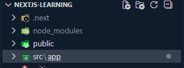
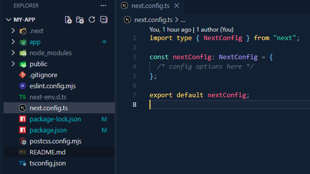
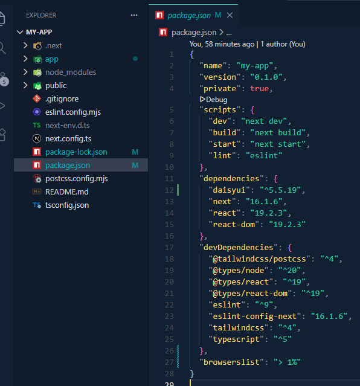
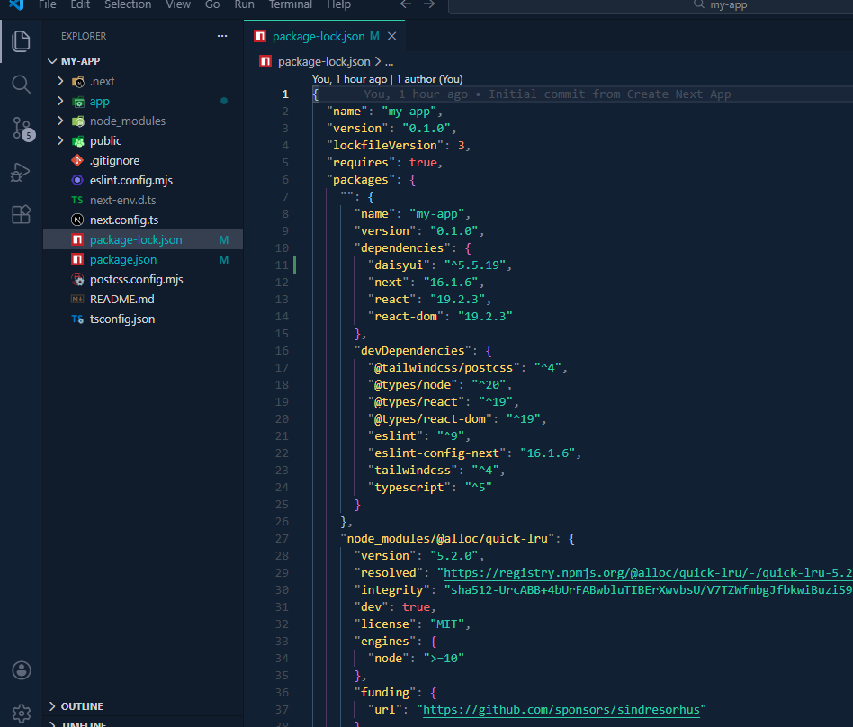
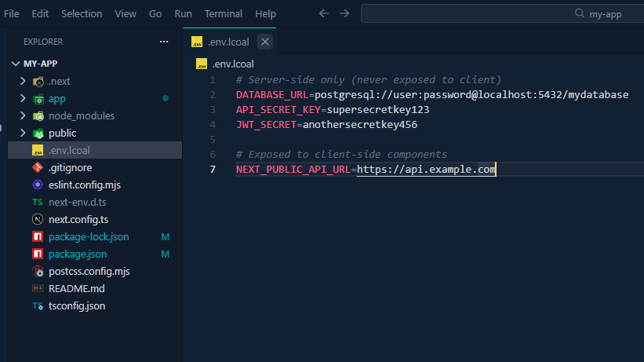
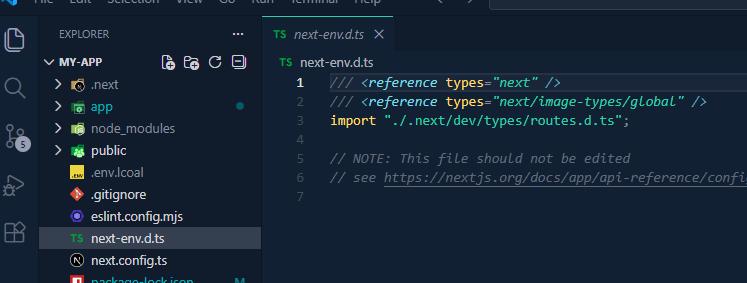
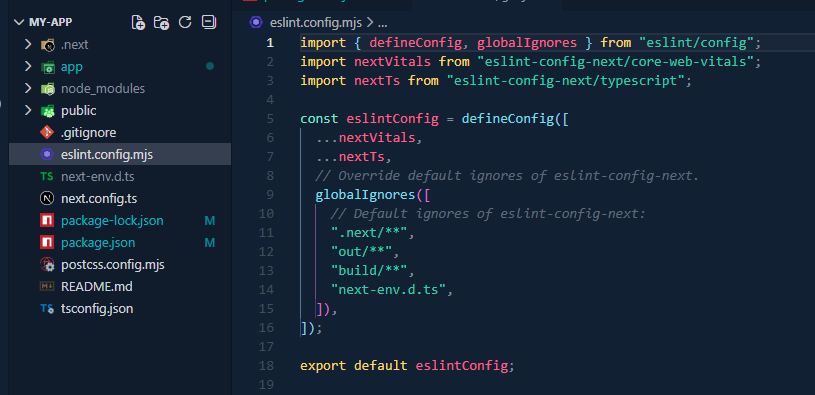
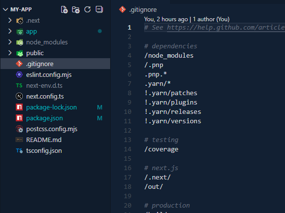
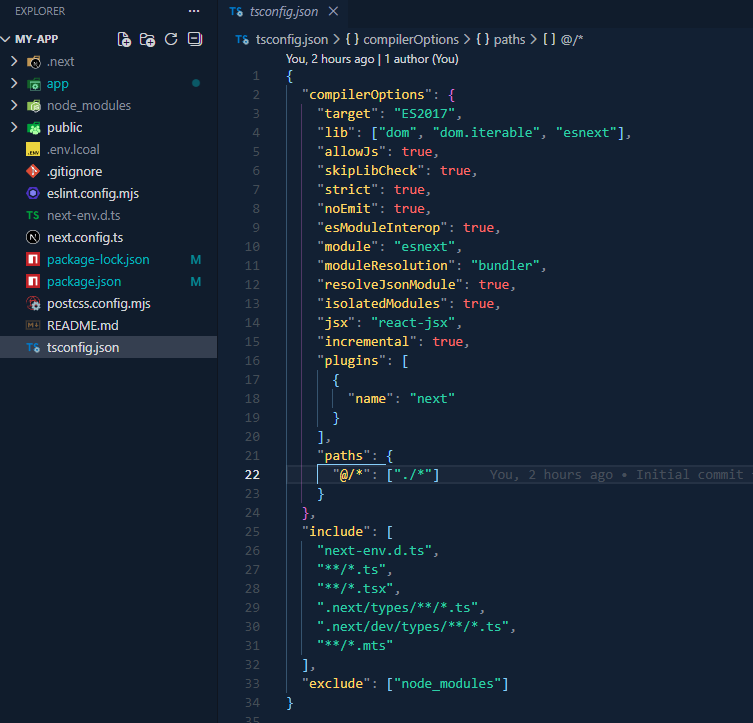

<h1 align="center">Next.js Notes</h1>

- [Setup:](#setup)
- [Introduction:](#introduction)
    - [What is Next.js:](#what-is-nextjs)
    - [Key Features of Next.js:](#key-features-of-nextjs)
    - [Difference Between Library and Framework:](#difference-between-library-and-framework)
    - [Difference Between React and Next.js:](#difference-between-react-and-nextjs)
    - [Components in Next.js:](#components-in-nextjs)
    - [When to use Server and Client Components:](#when-to-use-server-and-client-components)
    - [React Server Component:](#react-server-component)
      - [How RSC Marge Client Component inside Server Component:](#how-rsc-marge-client-component-inside-server-component)
- [Next.js Renderings:](#nextjs-renderings)
  - [1. Client Side Rendering(CSR):](#1-client-side-renderingcsr)
    - [LifeCycle of CSR:](#lifecycle-of-csr)
    - [Problems with CSR:](#problems-with-csr)
    - [When to use CSR:](#when-to-use-csr)
    - [How to make a page CSR:](#how-to-make-a-page-csr)
  - [2. Server Side Rendering(SSR):](#2-server-side-renderingssr)
    - [LifeCycle of SSR:](#lifecycle-of-ssr)
    - [Problems with SSR:](#problems-with-ssr)
    - [When to use SSR:](#when-to-use-ssr)
    - [How to make a page SSR:](#how-to-make-a-page-ssr)
  - [3. Static Site Generation(SSG):](#3-static-site-generationssg)
    - [LifeCycle of SSG:](#lifecycle-of-ssg)
    - [Problems with SSG:](#problems-with-ssg)
    - [When to use SSG:](#when-to-use-ssg)
    - [How to make a page SSG:](#how-to-make-a-page-ssg)
  - [4. Incremental Static Regeneration(ISR):](#4-incremental-static-regenerationisr)
    - [Problem With ISR:](#problem-with-isr)
    - [When to use ISR:](#when-to-use-isr)
    - [How to make a page ISR:](#how-to-make-a-page-isr)
  - [Quick Decision Rule:](#quick-decision-rule)
  - [Difference Between CSR, SSR, SSG, ISR:](#difference-between-csr-ssr-ssg-isr)
- [Folder and File Conventions:](#folder-and-file-conventions)
  - [Top-level Folders:](#top-level-folders)
  - [Top-level Files:](#top-level-files)
  - [Routing Files:](#routing-files)
  - [Nested Routes:](#nested-routes)
  - [Dynamic Routes:](#dynamic-routes)
  - [API Routes:](#api-routes)
  - [Route Groups:](#route-groups)
  - [Private Folders:](#private-folders)
- [Linking and Navigating:](#linking-and-navigating)
    - [`<Link>` (Declarative Navigation):](#link-declarative-navigation)
    - [`useRouter()` (programmatic Navigation):](#userouter-programmatic-navigation)
    - [`redirect()` (Server Redirect):](#redirect-server-redirect)
    - [`notFound()` (Triggers nearest not-found.tsx):](#notfound-triggers-nearest-not-foundtsx)

# Setup: 

Step 1: Create a new Next.js project:

```bash
npx create-next-app@latest
```

Then answer the following question, since we need to write our code on `src` folder, so we chose the 3rd options:

```
What is your project named? my-app
```

```
? Would you like to use the recommended Next.js defaults? » - Use arrow-keys. Return to submit.
    Yes, use recommended defaults
    No, reuse previous settings
>   No, customize settings - Choose your own preferences
```

Then answer the following questions: 

```
√ Would you like to use TypeScript? ... No / Yes
√ Which linter would you like to use? » ESLint
√ Would you like to use React Compiler? ... No / Yes
√ Would you like to use Tailwind CSS? ... No / Yes
√ Would you like your code inside a `src/` directory? ... No / Yes
√ Would you like to use App Router? (recommended) ... No / Yes
√ Would you like to customize the import alias (`@/*` by default)? ... No / Yes
Creating a new Next.js app in C:\Users\conta\Desktop\test\my-test-app.
```

Step 2: If you want to install daisyUI: 

```bash
npm i daisyui@latest
npm pkg set browserslist="> 1%"
```

app/global.css:

```
@import "tailwindcss";
@plugin "daisyui";
```


# Introduction: 

### What is Next.js: 
Next.js is a React framework for building high-performance, SEO-optimized web applications. It extends React by providing structured routing, data fetching model, built-in backend capabilities, different types of optimization, and multiple rendering strategies within a single unified framework.

### Key Features of Next.js: 
- Multiple rendering (CSR, SSR, SSG, ISR)
- File-based routing system
- Built-in API routes 
- Built-in Data Fetching: `getStaticProps`, `getServerSideProps`, `getStaticPaths`, `fetch` (for client components)
- Built-in SEO Optimization
- Built-in Image and font Optimization
- Built-in TS and Tailwind css support
- Automatic Code Splitting: Only loads the JavaScript needed for each page, improving performance.


### Difference Between Library and Framework: 

| library                                                     | framework                                                       |
| ----------------------------------------------------------- | --------------------------------------------------------------- |
| Usually solves a specific problem                           | Usually solves multiple problems at a time.                     |
| Does not control the overall application lifecycle.         | control the overall application lifecycle.                      |
| We design the folder structure, architecture, and patterns. | Already predefined or strongly guided                           |
| Highly flexible.                                            | less flexible.                                                  |
| We decides when and where to call the library.              | It decides when and where our code runs (Inversion of Control). |


### Difference Between React and Next.js: 

| Feature                  | **React**                                 | **Next.js**                                   |
| ------------------------ | ----------------------------------------- | --------------------------------------------- |
| **Type**                 | JavaScript library for building UI        | React Framework for building full-stack apps  |
| **Rendering**            | Only client-side by default (CSR)         | Supports CSR, SSR, SSG, and ISR               |
| **Routing**              | Manual with libraries like `react-router` | File-based routing built-in                   |
| **Server-side features** | Needs additional setup                    | Built-in API routes and server-side rendering |
| **SEO**                  | Poor by default (CSR)                     | Built-in SEO Optimization                     |


### Components in Next.js: 
In Next.js, there are two types of components: 

- Server Component(default): A React component that runs on the server. It has different types of rendering methods like SSR, SSG, ISR. 

- Client Component("use client"): A React component that runs on the browser. It has only one type of rendering methods that is CSR.

Note: In Next.js, components are server components by default. To make a component client component, we need to add the "use client" directive at the top of the component file.

### When to use Server and Client Components: 

| Component Type   | Guideline                                        |
| ---------------- | ------------------------------------------------ |
| Client Component | Only for UI interaction or dynamic behavior      |
| Server Component | Use everywhere else for performance and security |

**Golden Rule:** Keep components server-first, make only the interactive parts client components.


### React Server Component: 
Next.js App Router uses React Server Components (RSC) to merge server and client components in a single tree.

#### How RSC Marge Client Component inside Server Component:

- Browser sends request to server
- Server executes Server Components and fetches data
- Server generates:
  - HTML (for immediate paint)
  - For every Client Component, a placeholder in the HTML (like a <div> with React metadata).
  - A serialized RSC payload containing:
    - Props for Client Components
    - Component tree structure
- Server returns:
  - HTML (which includes references to CSS & JS assets) 
  - RSC payload
- Browser parses HTML → content visible immediately
- Browser downloads CSS and JS files referenced in `<link>` and `<script>` tags
- CSS is applied
- JavaScript executes
- React by the help of RSC payload:
  - Reconstructs component tree 
  - Hydrates Client Components and Page becomes fully interactive


```tsx
// src/app/posts/page.tsx

import React from 'react'
import ShowPostsWithLikeFeature from '../components/ShowPostsWithLikeFeature';

type PostType = {
    userId: number;
    id: number;
    title: string;
    body: string;
};

export default async function PostsPage() {
    const res = await fetch("https://jsonplaceholder.typicode.com/posts")
    const posts: PostType[] = await res.json()
    return (
        <div>
            <h1 className='text-center my-10 text-5xl font-bold'>Welcome to Posts Page</h1>
            {posts.map(post => <ShowPostsWithLikeFeature key={post.id} post={post}></ShowPostsWithLikeFeature>)}
        </div>
    )
}
```

```tsx
// src/app/components/ShowPostsWithLikeFeature.tsx

"use client";
import React, { useState } from 'react'

type PostType = {
    userId: number;
    id: number;
    title: string;
    body: string;
};


export default function ShowPostsWithLikeFeature({ post }: { post: PostType }) {
    const [liked, setLiked] = useState(false);
    return (
        <div className="p-4 border rounded shadow-sm">
            <h2 className="font-semibold">{post.title}</h2>
            <p>{post.body}</p>
            <button className={`mt-2 px-3 py-1 rounded ${liked ? "bg-green-500 text-white" : "bg-gray-200"}`}
                onClick={() => setLiked(!liked)}>
                {liked ? "Liked" : "Like"}
            </button>
        </div>
    )
}
```

# Next.js Renderings:
Rendering is the process of generating the ui from code (components, templates, or data) so that it can be displayed visually in the browser. Depending on how the component is configured, Rendering can happen in different ways in Next.js:, like: 
- Client Side Rendering (CSR): done in the browser.
- Server Side Rendering (SSR): done on the server for every request.
- Static Site Generation (SSG): done once at build time.
- Incremental Static Regeneration (ISR): done at build time and updated later automatically within a revalidation time.

## 1. Client Side Rendering(CSR): 
CSR is the default rendering method for React. 

### LifeCycle of CSR: 
- Browser sends a request to the server
- Server returns minimal HTML (div id="root") including reference of CSS & JS
- Browser parses HTML immediately → empty page (blank root div) is shown
- CSS downloads → styles are applied (still not interactive)
- JavaScript downloads and executes
- React mounts the application inside the root div → UI becomes visible and interactive
- After mounting, client-side data fetching happens (useEffect, etc.), and UI updates when data arrives

**Note:** In React mounting is the process where a React component is created and inserted into the DOM for the first time.

### Problems with CSR: 
- SEO limitations: Search engines may see just a black div with id root, which can lead to poor search engine rankings.
- Performance issues: Users see a black page for a few seconds until the JavaScript is fully downloaded and executed, This can negatively impact:
  - First Contentful Paint (FCP)
  - Time To Interactive (TTI)
- Larger JS bundle
- Data fetching happens after mount

### When to use CSR: 
- When SEO is not a concern
- When you have a highly interactive application that relies heavily on user interactions.

### How to make a page CSR: 

```tsx
// app/csr/page.tsx
"use client"

import { useEffect, useState } from "react"

type Post = {
  id: number
  title: string
}

export default function CSRPage() {
  const [posts, setPosts] = useState<Post[]>([])

  useEffect(() => {
    fetch("https://jsonplaceholder.typicode.com/posts")
      .then(res => res.json())
      .then(data => setPosts(data))
  }, [])

  return (
    <div>
      <h1>CSR Page</h1>
      {posts.map(post => (
        <p key={post.id}>{post.title}</p>
      ))}
    </div>
  )
}
```

## 2. Server Side Rendering(SSR): 
Server-Side Rendering means that React components are rendered on the server for each request, and the browser receives fully rendered HTML instead of a blank page.

### LifeCycle of SSR:
- Browser sends request to server
- Server executes Server Components and fetches data
- Server generates:
  - HTML (for immediate paint)
  - RSC payload (serialized React component instructions)
- Server returns:
  - HTML (which includes references to CSS & JS assets) 
  - RSC payload
- Browser parses HTML → content visible immediately
- Browser downloads CSS and JS files referenced in `<link>` and `<script>` tags
- CSS is applied
- JavaScript executes
- React by the help of RSC payload:
  - Reconstructs component tree 
  - Hydrates Client Components and Page becomes fully interactive


**Note:**: Hydration means React takes the server-rendered HTML and Attaches event listeners, Connects it to the React Virtual DOM and finally Makes Client Components interactive. 

**Note:** Server Components never hydrate. 

### Problems with SSR:
- Increased server load: The server must render pages per request (next.js handles it by caching)..
- Still requires JavaScript to be fully interactive, so even the first contentful paint (FCP) is faster, the time to interactive (TTI) still be delayed until the JavaScript is fully executed (next.js handles it by RSC)

### When to use SSR: 
- When SEO is a concern
- When you want to ensure faster first contentful paint (FCP).
- User-specific content (profile pages, dashboards with personalization).
- Frequently updated content that must be fresh per request.
- Pages requiring secure server-side logic.

### How to make a page SSR: 

```tsx
// app/ssr/page.tsx

type Post = {
  id: number
  title: string
}

export default async function SSRPage() {
  const res = await fetch("https://jsonplaceholder.typicode.com/posts", {
    cache: "no-store",
  })

  const posts: Post[] = await res.json()

  return (
    <div>
      <h1>SSR Page</h1>
      {posts.map(post => (
        <p key={post.id}>{post.title}</p>
      ))}
    </div>
  )
}
```

Note: fetch function in next.js not the same fetch in react.js. Here, next.js optimize the fetch function so it can catch data. So, if the data not changes, next.js automatically chased the data by using fetch function. So for the same data, if we request again next.js don't fetch those data, next.js just give us the data by their catch. Here, we disabled the cache for just for describe the SSR behavior (render every request) thats it.

but for below dynamic route example the fetch function could't cached, because it's dynamic:

```tsx
// app/ssr/[id]/page.tsx

type Post = {
  userId: number
  id: number
  title: string
  body: string
}

type PageProps = {
  params: {
    id: string
  }
}

export default async function PostDetailsPage({ params }: PageProps) {
  const res = await fetch(`https://jsonplaceholder.typicode.com/posts/${params.id}`)

  const post: Post = await res.json()

  return (
    <div>
      <h1>Post Details</h1>
      <h2>{post.title}</h2>
      <p>{post.body}</p>
    </div>
  )
}
```

## 3. Static Site Generation(SSG): 
Static Site Generation (SSG) means the React components are pre-rendered at build time, not per request. The server generates the HTML once during the build, and the same pre-rendered HTML is served for all requests

In Next.js, we need to use getStaticProps() to fetch data at build time and can getStaticPaths() for dynamic routes that need pre-rendering.This approach is ideal for pages with data that doesn’t change often (blogs, marketing pages, docs, etc.).


### LifeCycle of SSG: 
1. Build Time: 
   - Server executes React components
   - Required data is fetched from APIs or databases
   - HTML + RSC payload is generated for each page and stored in build output (static files)
2. Request Time: 
   - Browser sends request to server or CDN
   - Server returns:
     - cached pre pre-rendered HTML (which includes references to CSS & JS) and RSC payload
   - Browser parses HTML → content visible immediately
   - Browser downloads CSS and JS files referenced in `<link>` and `<script>` tags
   - CSS is applied
   - JavaScript executes
   - React by the help of RSC payload:
     - Reconstructs component tree 
     - Hydrates Client Components and Page becomes fully interactive


### Problems with SSG: 
- Content can become outdated.
- Requires rebuilding the app to update content (unless using ISR).
- Not ideal for highly dynamic data.

### When to use SSG: 
- Marketing pages.
- Blog posts.
- Documentation.
- Landing pages.
- Content that rarely changes.

### How to make a page SSG: 

```tsx
// app/ssg/page.tsx

type Post = {
  id: number
  title: string
}

export default async function SSGPage() {
  const res = await fetch("https://jsonplaceholder.typicode.com/posts")

  const posts: Post[] = await res.json()

  return (
    <div>
      <h1>SSG Page</h1>
      {posts.map(post => (
        <p key={post.id}>{post.title}</p>
      ))}
    </div>
  )
}
```

For dynamic routes: 

```tsx
// app/ssg/[id]/page.tsx

type Post = {
  userId: number
  id: number
  title: string
  body: string
}

type PageProps = {
  params: {
    id: string
  }
}

export async function generateStaticParams() {
  const res = await fetch("https://jsonplaceholder.typicode.com/posts")

  const posts: Post[] = await res.json()

  return posts.map(post => ({
    id: post.id.toString()
  }))
}

export default async function PostDetailsPage({ params }: PageProps) {
  const res = await fetch(`https://jsonplaceholder.typicode.com/posts/${params.id}`)

  const post: Post = await res.json()

  return (
    <div>
      <h1>Post Details</h1>
      <h2>{post.title}</h2>
      <p>{post.body}</p>
    </div>
  )
}
```

here, generateStaticPrams is the main worker function the make a from SSR to SSG, it's fetch all id and make a page SSG at build time.

## 4. Incremental Static Regeneration(ISR): 
Incremental Static Regeneration (ISR) is a feature in Next.js that combines the speed of SSG with the flexibility of SSR. With ISR, we can specify a revalidation time for each page, and Next.js will automatically regenerate the page in the background when a request comes in after the revalidation time has passed.

### Problem With ISR:
- Slight complexity in cache invalidation logic.
- First request after expiration may be slower (revalidation).
- Not ideal for real-time updates.

### When to use ISR: 
- E-commerce product pages.
- News sites.
- Blogs with periodic updates.
- Large content-driven platforms. 

### How to make a page ISR: 

There are two ways to make a pag ISR: 
- Using route-level revalidation: 

```tsx
// app/isr/page.tsx

export const revalidate = 60 

type Post = {
  id: number
  title: string
}

export default async function ISRPage() {
  const res = await fetch("https://jsonplaceholder.typicode.com/posts")

  const posts: Post[] = await res.json()

  return (
    <div>
      <h1>ISR Page</h1>
      {posts.map(post => (
        <p key={post.id}>{post.title}</p>
      ))}
    </div>
  )
}
```

For dynamic routes: 

```tsx
// app/isr/[id]/page.tsx

export const revalidate = 60

type Post = {
  userId: number
  id: number
  title: string
  body: string
}

type PageProps = {
  params: {
    id: string
  }
}


export async function generateStaticParams() {
  const res = await fetch("https://jsonplaceholder.typicode.com/posts")

  const posts: Post[] = await res.json()

  return posts.map(post => ({
    id: post.id.toString(),
  }))
}

export default async function PostDetailsPage({ params }: PageProps) {
  const res = await fetch(`https://jsonplaceholder.typicode.com/posts/${params.id}`)

  const post: Post = await res.json()

  return (
    <div>
      <h1>Post Details (ISR)</h1>
      <h2>{post.title}</h2>
      <p>{post.body}</p>
    </div>
  )
}
```

- Using fetch level revalidation: 

```tsx
// app/isr/page.tsx

type Post = {
  id: number
  title: string
}

export default async function ISRPage() {
  const res = await fetch("https://jsonplaceholder.typicode.com/posts", {
    next: { revalidate: 60 }
  })

  const posts: Post[] = await res.json()

  return (
    <div>
      <h1>ISR Page</h1>
      {posts.map(post => (
        <p key={post.id}>{post.title}</p>
      ))}
    </div>
  )
}
```

For dynamic routes: 

```tsx
// app/isr/[id]/page.tsx

type Post = {
  userId: number
  id: number
  title: string
  body: string
}

type PageProps = {
  params: {
    id: string
  }
}


export async function generateStaticParams() {
  const res = await fetch("https://jsonplaceholder.typicode.com/posts", {
    next: { revalidate: 60 }
  })

  const posts: Post[] = await res.json()

  return posts.map(post => ({
    id: post.id.toString(),
  }))
}

export default async function PostDetailsPage({ params }: PageProps) {
  const res = await fetch(`https://jsonplaceholder.typicode.com/posts/${params.id}`, {
    next: { revalidate: 60 }
  })

  const post: Post = await res.json()

  return (
    <div>
      <h1>Post Details (ISR)</h1>
      <h2>{post.title}</h2>
      <p>{post.body}</p>
    </div>
  )
}
```


## Quick Decision Rule: 

| If You Need                         | Use |
| ----------------------------------- | --- |
| High interactivity, no SEO          | CSR |
| Fresh data every request            | SSR |
| Static content, best performance    | SSG |
| Mostly static, but periodic updates | ISR |


## Difference Between CSR, SSR, SSG, ISR: 

| Feature            | **CSR**                 | **SSR**                       | **SSG**                       | **ISR**                                                   |
| ------------------ | ----------------------- | ----------------------------- | ----------------------------- | --------------------------------------------------------- |
| **Where rendered** | Browser                 | Server per request            | Server at build               | Server at build + periodic updates                        |
| **HTML sent**      | Mostly empty            | Fully rendered                | Fully rendered                | Fully rendered                                            |
| **Data fetching**  | Client (`useEffect`)    | Server (`getServerSideProps`) | Build time (`getStaticProps`) | Build time + background (`getStaticProps` + `revalidate`) |
| **Interactivity**  | Hydrates after JS loads | Hydrates after HTML           | Hydrates after HTML           | Hydrates after HTML                                       |
| **Speed / FCP**    | Slower first paint      | Fast                          | Very fast                     | Very fast, updated in background                          |
| **SEO**            | Poor                    | Good                          | Excellent                     | Excellent                                                 |
| **Best use case**  | Interactive apps        | Dynamic pages                 | Static pages                  | Mostly static pages with occasional updates               |
| **Server load**    | Low                     | Higher                        | Very low                      | Low                                                       |

Summary: 
- CSR → Server sends empty HTML → React builds UI
- SSR → Server builds HTML per request → React hydrates
- SSG → Server builds HTML at build time → React hydrates
- ISR → Server builds HTML at build time + regenerates later → React hydrates


# Folder and File Conventions:

## Top-level Folders:
Top-level folders are used to organize next.js application's code and static assets.

- `public`:	Static assets to be served
- `node_modules`: The folder where all NPM installed packages and their dependencies are stored, so our project can run on node.js.
- `app`:	The core folder of the App Router architecture. In App Router projects, this is where our application starts. It Contains: 
  - page.tsx → Route entry
  - layout.tsx → Shared layouts
  - loading.tsx → Loading UI
  - error.tsx → Error boundaries
  - not-found.tsx → 404 UI 
  - and nested routes, pages, components, API etc.  
- `src` : Optional folder but recommended for medium-to-large projects to keep the root clean (not create by default, you can choose to create it).
  - Instead of:
    - app/
    - components/
    - lib/ 
  - we can manage: 
     ```
      src/
      ├── app/
      ├── components/
      ├── lib/
      ├── hooks/ 
     ```



## Top-level Files: 
Top-level files are configuration and metadata files located at the project root that control how the Next.js application is built, configured, executed, and deployed.

- next.config.js: Configuration file for Next.js. It allows you to customize framework behavior.
  


- package.json: Is a human-readable file that declares the dependencies, dev-dependencies, scripts, and metadata of our project.

  - dependencies – Packages needed to run the app (e.g., React, Next.js, daisyui etc).
  - devDependencies – Packages needed for development only (e.g., typescript, eslint, tailwindcss etc).
  - scripts – Commands for running tasks like dev, build, start.
  - Metadata – Project name, version, author, license, description



- package-lock.json: Is an auto-generated file that locks the exact versions of all installed packages. It ensures that every developer or environment installs exactly the same package versions for preventing inconsistencies.



- .env.local: Environment variables that should not be tracked by version control. Used for sensitive data like API keys, database credentials etc.
  - Variables prefixed with NEXT_PUBLIC_ are exposed in browser.
  - Variables without the prefix are only accessible on the server side and not exposed in browser.



- next-env.d.ts: A TypeScript declaration file automatically generated by Next.js.



- eslint.config.mjs:	Configuration file for ESLint
  - ESLint is a static code analysis tool for JavaScript and TypeScript that helps you find and fix problems in your code. It enforces coding standards, catches bugs, and improves code quality by analyzing your code against a set of rules when you type code.



- .gitignore: containers specifies files and directories(folders) that ignored by Git.



- tsconfig.json: Configuration file for TypeScript. It tells the TypeScript compiler (tsc) how to compile your TypeScript code into JavaScript.



## Routing Files:
Routing files are special files that define how routes behave, what UI they render, and how errors/loading states are handled.

| File           | Purpose                                                                                                                                     |
| -------------- | ------------------------------------------------------------------------------------------------------------------------------------------- |
| `layout`       | Defines a shared UI wrapper for a route segment and its nested routes                                                                       |
| `page`         | Represents the primary UI for a route                                                                                                       |
| `route`        | Defines server-side API handlers (e.g., GET, POST, PUT, DELETE).                                                                            |
| `loading`      | Displays instant loading UI while a route segment is being streamed or data is being fetched. Automatically wrapped in a Suspense boundary. |
| `not-found`    | 404 page UI when a route does not exist.                                                                                                    |
| `error`        | Error UI for a specific route                                                                                                               |
| `global-error` | Error UI for the entire app                                                                                                                 |


**Example:**

```
src/
 └── app/
      ├── layout.tsx
      ├── page.tsx
      ├── loading.tsx
      ├── error.tsx
      ├── global-error.tsx
      ├── not-found.tsx
      ├── dashboard/
      │     ├── page.tsx
      │     ├── loading.tsx
      │     ├── error.tsx
      │     └── not-found.tsx
      └── api/
            └── hello/
                  └── route.ts
```

```tsx
// src/app/layout.tsx

import type { Metadata } from "next";
import "./globals.css";


export const metadata: Metadata = {
  title: "Create Next App",
  description: "Generated by create next app",
};

export default function RootLayout({
  children,
}: Readonly<{
  children: React.ReactNode;
}>) {
  return (
    <html lang="en">
      <body>
        {children}
      </body>
    </html>
  );
}
```

```tsx
// src/app/page.tsx

export default function Home() {
  return (
    <div>
      <h1>Home Page</h1>
      <p>This is the main route (/)</p>
    </div>
  );
}
```

```tsx
// src/app/loading.tsx

import React from 'react'

export default function loading() {
    return (
        <div>Loading Home Page........</div>
    )
}
```

```tsx
// src/app/error.tsx
// For testing, Inside the page.tsx, temporarily add: `throw new Error("Test root error");`

"use client";

export default function Error({
    error,
    reset,
}: {
    error: Error;
    reset: () => void;
}) {
    return (
        <div>
            <h2>Something went wrong on this route.</h2>
            <p>{error.message}</p>
            <button onClick={() => reset()}>Try Again</button>
        </div>
    );
}
```

```tsx
// src/app/global-error.tsx
// Note: This must include `<html>` and `<body>`.

"use client";

export default function GlobalError({
    error,
    reset,
}: {
    error: Error;
    reset: () => void;
}) {
    return (
        <html>
            <body>
                <h1>Global Error</h1>
                <p>{error.message}</p>
                <button onClick={() => reset()}>Reload</button>
            </body>
        </html>
    );
}
```

```tsx
// src/app/not-found.tsx

export default function NotFound() {
    return (
        <div>
            <h1>404 - Page Not Found</h1>
            <p>This route does not exist.</p>
        </div>
    );
}
```

```tsx
// src/app/dashboard/page.tsx

import { notFound } from "next/navigation";

export default async function DashboardPage() {
    // forcefully want 2 sec for showing loading spinner
    await new Promise((res) => setTimeout(res, 2000));

    // if you want forcefully render notFound(), then make it true
    const shouldNotExist = false;

    if (shouldNotExist) {
        notFound();
    }

    return (
        <div>
            <h1>Dashboard Page</h1>
            <p>This is /dashboard route.</p>
        </div>
    );
}
```

```tsx
// src/app/dashboard/loading.tsx

export default function DashboardLoading() {
    return <h2>Loading Dashboard...</h2>;
}
```

```tsx
// src/app/dashboard/error.tsx

"use client";

export default function DashboardError({
    error,
    reset,
}: {
    error: Error;
    reset: () => void;
}) {
    return (
        <div>
            <h2>Dashboard Error</h2>
            <p>{error.message}</p>
            <button onClick={() => reset()}>Try Again</button>
        </div>
    );
}
```

```tsx
// src/app/dashboard/not-found.tsx

export default function DashboardNotFound() {
    return (
        <div>
            <h1>Dashboard Not Found</h1>
        </div>
    );
}
```

```tsx
// src/app/api/hello/route.ts
// http://localhost:3000/api/hello

import { NextResponse } from "next/server";

export async function GET() {
    return NextResponse.json({
        message: "Hello from API Route",
    });
}
```

## Nested Routes:
Nested routes are pages inside other pages.

```
src
└── app
    ├── layout.tsx                     
    ├── page.tsx                       (/)

    └── dashboard
        ├── layout.tsx                 
        ├── page.tsx                   (/dashboard)

        ├── analytics
        │   ├── page.tsx               (/dashboard/analytics)
        │   └── reports
        │       ├── page.tsx           (/dashboard/analytics/reports)
        │       ├── yearly
        │       │   └── page.tsx       (/dashboard/analytics/reports/yearly)
        │       └── monthly
        │           └── page.tsx       (/dashboard/analytics/reports/monthly)

        ├── users
        │   ├── page.tsx               (/dashboard/users)
        │   ├── active
        │   │   └── page.tsx           (/dashboard/users/active)
        │   └── inactive
        │       └── page.tsx           (/dashboard/users/inactive)

        └── settings
            ├── page.tsx               (/dashboard/settings)
            ├── profile
            │   └── page.tsx           (/dashboard/settings/profile)
            └── security
                └── page.tsx           (/dashboard/settings/security)
```

Note: Even though route structure is defined through folders, a route is not publicly accessible until a page.js or route.js file is added to a route segment.


This means that project files can be safely colocated inside route segments in the app directory without accidentally being routable.


## Dynamic Routes: 
Dynamic routes are routes where a part of the URL is variable, not fixed. They are created using square brackets and its called segment.

In Next.js there are three types of dynamic route segments available:

1. [slug] → Matches exactly 1 URL segment.

```
blog/[slug]/page.tsx

<!-- Matches: -->

/blog/post-1
/blog/hello-world

<!-- Does NOT match: -->

/blog/2024/post-1   
```

Example: 

```tsx
// app/blog/[slug]/page.tsx

type PageProps = {
    params: Promise<{ slug: string }>
}

export default async function BlogPostPage({ params }: PageProps) {
    const { slug } = await params

    return (
        <div>
            <h1>Single Slug</h1>
            <p>Slug: {slug}</p>
        </div>
    )
}
```

2. [...slug] — Matches 1 or more URL segments.

```
blog/[...slug]/page.tsx

<!-- Matches: -->

/docs/a
/docs/a/b
/docs/a/b/c

<!-- Does NOT match: -->

/docs    
```

Example: 

```tsx
// app/docs/[...slug]/page.tsx

type PageProps = {
    params: Promise<{ slug: string[] }>
}

export default async function DocsPage({ params }: PageProps) {
    const { slug } = await params
    // if you enter http://localhost:3000/docs/react/hooks/use-effect
    console.log(slug) // [ 'react', 'hooks', 'use-effect' ]
    return (
        <div>
            <h1>Catch All Route</h1>
            <p>Full Path: {slug.join('/')}</p>
        </div>
    )
}
```

3. [[...slug]] — Matches 0 or more URL segments.

```
blog/[[...slug]]/page.tsx

<!-- Matches: -->

/shop
/shop/a
/shop/a/b
/shop/a/b/c

note: /shop = undefined
```

Example: 

```tsx
// app/shop/[[...slug]]/page.tsx

type PageProps = {
    params: Promise<{ slug?: string[] }>
}

export default async function ShopPage({ params }: PageProps) {
    const { slug } = await params

    // if http://localhost:3000/shop then slag = undefined
    // if http://localhost:3000/shop/electronics/laptops then slug - [ 'electronics', 'laptops' ]
    console.log(slug)

    const path = slug?.join('/') ?? "shop"
    return (
        <div>
            <h1>Optional Catch All</h1>
            <p>Path: {path}</p>
        </div>
    )
}
```

## API Routes: 
API Routes in Next.js are built-in server endpoints that let you implement backend logic and database operations inside the same project, without needing a separate Express or Node server.

```tsx
// src/lib/dbConnect.ts
import { MongoClient, ServerApiVersion } from "mongodb";


export function dbConnect(collectionName: string) {
    const uri = process.env.MONGO_URI

    const client = new MongoClient(uri, {
        serverApi: {
            version: ServerApiVersion.v1,
            strict: true,
            deprecationErrors: true,
        }
    })

    return client.db(process.env.DB_NAME).collection(collectionName)
}
```

```tsx
// src/app/api/items/routes
// http://localhost:3000/api/items

import { dbConnect } from "@/lib/dbConnect"
import { NextRequest } from "next/server"

export async function GET() {
    const result = dbConnect("itemsCollection").find({}).toArray()
    return Response.json(result)
}

export async function POST(req: NextRequest) {
    const postedData = await req.json()
    const result = dbConnect("itemsCollection").insertOne(postedData)
    return Response.json({ result })
}
```

```tsx
// src/app/api/items/[id]/routes
// http://localhost:3000/api/items/id

import { dbConnect } from "@/lib/dbConnect"
import { ObjectId } from "mongodb"
import { NextRequest } from "next/server"


type PageProps = {
    params: Promise<{ id: string }>
}


export async function GET(req: NextRequest, { params }: PageProps) {
    const p = await params
    const result = dbConnect("itemsCollection").findOne({ _id: new ObjectId(p.id) })

    return Response.json(result)
}

export async function DELETE(req: NextRequest, { params }: PageProps) {
    const p = await params
    const result = dbConnect("itemsCollection").deleteOne({ _id: new ObjectId(p.id) })

    return Response.json(result)
}


export async function PATCH(req: NextRequest, { params }: PageProps) {
    const p = await params
    const updatedData = req.json()
    const filter = { _id: new ObjectId(p.id) }
    const updatedData = {
      $set: {
        updatedData
      }
    }
    const result = dbConnect("itemsCollection").updateOne(filter, updatedData)

    return Response.json(result)
}
```

## Route Groups:
Route groups (folderName) used to separate features or sections of a route without affecting the URL.

```
app/
  (auth)/
    login/
    register/

  (dashboard)/
    analytics/
    users/
```

Even though folders are grouped: /login, /register, /analytics, /users etc, there is no (auth) or (dashboard) in the URL. 

Means Routes groups don't create routes.


<!-- ## Parallel Routes: 
Parallel Routes (@folder) render multiple routes at the same time without unmounting each other. Perfect for sidebars, persistent headers, dashboards.

```
app/
 ├─ dashboard/
 │   ├─ layout.tsx
 │   ├─ page.tsx
 │   ├─ @sidebar/
 │   │   └─ page.tsx
 │   └─ settings/
 │       └─ page.tsx
```

```tsx
// dashboard/layout.tsx

type LayoutProps = {
  children: React.ReactNode
  sidebar: React.ReactNode
}

export default function DashboardLayout({
  children,
  sidebar,
}: LayoutProps) {
  return (
    <div className="flex">
      <div className="w-1/4 bg-gray-100 p-4">
        {sidebar}
      </div>

      <div className="flex-1 p-6">
        {children}
      </div>
    </div>
  )
}
```

```tsx
// dashboard/page.tsx

export default function DashboardHome() {
  return <h1>Dashboard Home</h1>
}
```

```tsx
// @sidebar/page.tsx

export default function Sidebar() {
  return (
    <div>
      <h2>Dashboard Sidebar</h2>
      <ul>
        <li>Overview</li>
        <li>Settings</li>
      </ul>
    </div>
  )
}
```

so, when you visit `/dashboard`, Next renders:
- @sidebar/page.tsx → into sidebar
- dashboard/page.tsx → into children

But when you When you navigate to `/dashboard/settings`, next.js: 
- Only render changed children.
- @sidebar stays mounted.
 -->

<!-- ## Intercepted Routes: 
Intercepted routes allow overlays or modals a route on top of the current route, without unmounting the underlying route.

In Next.js there are 4 types of intercepted available: 

### 1. Intercept Sibling (.)folder: 
Preview a sibling page in a modal.

```
app/
 ├─ dashboard/
 │   ├─ page.js
 │   └─ (.)details/
 │       └─ page.js
```

here, Navigate to /dashboard/(.)details → modal appears on top of dashboard without  un-mounted Dashboard.

### 2. Intercept Parent (..)folder: 
Open a child route as an overlay on the parent.

```
app/
 ├─ projects/
 │   ├─ page.js
 │   └─ (..)tasks/
 │       └─ page.js
```

Navigating to /projects/(..)tasks shows tasks overlay while the parent projects page remains visible.

### 3. Intercept Two Levels (..)(..)folder: 
Deep nested modals or overlays.

```
app/
 ├─ organization/
 │   ├─ page.js
 │   └─ teams/
 │       └─ page.js
 │       └─ (..)(..)members/
 │           └─ page.js
```

Shows members overlay two levels up in the hierarchy.

### 4. Intercept From Root (...)folder
Global modal anywhere in the app.

```
app/
 ├─ page.js
 └─ (...)loginModal/
     └─ page.js
```
Navigate to / (...)loginModal → modal opens on top of any current page. Base page remains mounted, state preserved.
 -->


## Private Folders:
Private folders (_folderName) used to organize internal components, helpers, or utilities of a route without affecting the URL

Instead of mixing:

```
dashboard/
  page.tsx
  componentA.tsx
  componentB.tsx
  helper.ts
```
we can do:

```
dashboard/
  page.tsx
  _components/
  _utils/
```

The _components and _utils folder is not a route and Cannot be accessed in the browser. It's Exists only for making our routes folder clean and organized.

Private folders are not routable at all.


**Note:** if you don't want to use private folders there are others options available: 

- By Store project files outside of app: 


- By Store project files in top-level folders inside of app:


- By splitting project files by feature or route:


# Linking and Navigating:

### `<Link>` (Declarative Navigation):
In Next.js, `<Link>` not works same as react router `<Link>`, Because next.js has server component as well. For preventing slow navigation for server component ans as well as client component Next.js combines:

1. Prefetching (Optimized for server components):
Happens before navigation (background optimization). In next.js Prefetching happens when the link is hovered or enter the viewport, Its works differently based on server and client component: 
- For server component Prefetching happens when the link is hovered or enters the viewport 
- For client component Prefetching happens after hydration happens. 

Note: for example if we have a navbar: 
- If the navbar is server component prefetch happens when the navbar enters the viewport or when hover the links
- If the navbar is client component prefetch happens when the navbar is fully hydrate

2. Streaming (Only For Server Components):
Streaming allows the server to send UI in chunks (parts) by the help of react `<Suspense>` instead of waiting for everything.

```tsx
<Suspense fallback={<Loading />}>
  <SlowDataComponent />
</Suspense>
```
or you can just create a loading.tsx in your route folder:


```tsx
export default function Loading() {
  // Add fallback UI that will be shown while the route is loading.
  return <LoadingSkeleton />
}
```

Behind the scenes, Next.js will automatically wrap the page.tsx contents in a `<Suspense>` boundary. The prefetched fallback UI will be shown while the route is loading, and swapped for the actual content once ready.

3. Client-side Transitions (For both server and client component): 
Prevent Page Reload, because by default SSR need page reload for initial render.

**Note:** Keep `<Link>` in server components for best performance, especially in layouts, navbars, and repeated menus. Use client components only when you need interactivity. 


**Example:** 

```tsx
// app/components/Navbar.tsx (Server Component)
import Link from "next/link";
import ActiveLink from "./ActiveLinkClient";

export default function Navbar() {
  return (
    <nav className="flex gap-4 p-4 bg-gray-100">
      <ActiveLink href="/">Home</ActiveLink>
      <ActiveLink href="/dashboard">Dashboard</ActiveLink>
      <ActiveLink href="/profile">Profile</ActiveLink>
    </nav>
  );
}
```

```tsx
// app/components/ActiveLinkClient.tsx (Client Component)
"use client";
import { usePathname } from "next/navigation";
import Link from "next/link";

interface Props {
  href: string;
  children: React.ReactNode;
}

export default function ActiveLink({ href, children }: Props) {
  const pathname = usePathname();
  const isActive = pathname === href;
  // for nested pathname
  // const isActive = pathname.startsWith("/dashboard");

  return (
    <Link
      href={href}
      className={`px-3 py-2 rounded ${
        isActive ? "bg-blue-500 text-white" : "text-gray-700 hover:bg-gray-200"
      }`}
    >
      {children}
    </Link>
  );
}
```

### `useRouter()` (programmatic Navigation):
For Programmatic Navigation like buttons, forms, or logic-based navigation.

```ts
"use client";

import { useRouter } from "next/navigation";

export default function LoginButton() {
  const router = useRouter();

  const handleLogin = async () => {
    // auth logic
    router.push("/login");
  };

  return <button onClick={handleLogin}>Login</button>;
}
```

Available methods: 

```
router.push("/path")       // navigate (adds to history stack)
router.replace("/path")    // replace history (does not add to history)
router.back()              // go back
router.forward()           // go forward
router.refresh()           // re-fetch server components
router.prefetch("/path")   // prefetch route
```

### `redirect()` (Server Redirect): 

```tsx
import { redirect } from "next/navigation";

export default async function Page() {
  const user = await getUser();

  if (!user) {
    redirect("/login");
  }

  return <div>Dashboard</div>;
}
```

### `notFound()` (Triggers nearest not-found.tsx):

```tsx
import { notFound } from "next/navigation";

if (!data) {
  notFound();
}
```


